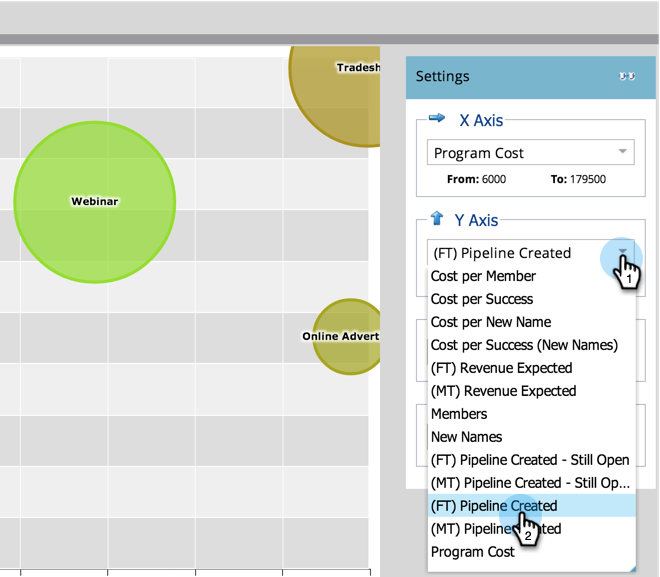

# Compare la eficacia de los Canales con el analizador de Programas {#compare-channel-effectiveness-with-the-program-analyzer}

Utilice el analizador de Programas para comparar los costes de canal, la adquisición de miembros, la canalización, los ingresos y mucho más, a fin de identificar los canales más y menos eficaces.

>[!PREREQUISITES]
>
>* [Creación de un analizador de Programas](create-a-program-analyzer.md)

1. Haga clic en **Analytics** en **My Marketing.**

   

1. Seleccione el **Analizador de Programa.**

   

1. Cambie la Vista a **Por** **Canal**.

   

1. Utilice la lista desplegable **Eje X** para elegir una métrica para el eje horizontal. Inicios con **Costo de Programa**.

   

1. Utilice la lista desplegable Eje Y para elegir una métrica para el eje vertical. Aquí, vamos con la tubería **(FT) creada**.

   

   >[!NOTE]
   >
   >Muchas de las métricas que puede elegir en el analizador de programa están disponibles con cálculos de primer toque (FT) y de varios toques (MT). Es importante comprender la [diferencia entre la atribución de FT y MT](/help/marketo/product-docs/reporting/revenue-cycle-analytics/revenue-tools/attribution/understanding-attribution.md).

1. Utilice la lista desplegable **Eje Y** para elegir **(MT) Canalización creada**.

   

   En esta vista de atribución multitáctil, vemos que el canal de seminario web influye más en la creación de los procesos y cuesta menos que los canales de presentación de ofertas y publicidad en línea.

   ¡Ahora vamos a añadir dos dimensiones más!

1. Utilice la lista desplegable **Tamaño de burbuja** para seleccionar una medida adicional, como **Nombres nuevos**.

   

1. Observe cómo cambia el gráfico.

   

   Vemos que el canal del seminario web se reduce, según la medición de **Nuevos nombres**. Podemos concluir que, si bien tiene muchos miembros, es menos eficaz para generar nuevos posibles clientes que el canal de la feria comercial.

1. Por último, utilice la lista desplegable Color para añadir la cuarta dimensión. Seleccionemos **(FT) Ingresos** **Ganado**.

   

1. Observe el cambio de color en el gráfico.

   

   A partir de los colores, aprendemos que el canal de la feria comercial, la burbuja más verde, ha influido en los ingresos buenos obtenidos, medidos por la atribución de primer toque.

1. Ahora, si cambiamos la métrica Color a **(MT) Ingresos Ganados**, vemos que el canal de Publicidad en Línea, ahora más verde, influyó en más ingresos -con el paso del tiempo- que los canales de Seminario Web y Presentación de Comercio.

   

En nuestro ejemplo, vemos que el canal de exhibición comercial es el más caro (más a la derecha) y el más exitoso (más alto en el eje Y) cuando se mide la canalización creada por el primer toque. Ahora, consideremos cada oleoducto de canales creado según la medición de la atribución multitáctil.

>[!TIP]
>
>Los ejemplos de estos pasos miden la eficacia en función de la canalización creada. Utilice la lista desplegable Eje Y para seleccionar otras formas de medir la eficacia del canal, como Nuevos nombres, Miembros, Costo por éxito, etc.

>[!MORELIKETHIS]
>
>* [Explorar los detalles de Programa y Canal con el analizador de Programas](explore-program-and-channel-details-with-the-program-analyzer.md)
>* [Comparar la eficacia de los Programas con el analizador de Programas](compare-program-effectiveness-with-the-program-analyzer.md)

>

>[!NOTE]
>
>Obtenga más información sobre los análisis avanzados en [Explorador del ciclo de ingresos](https://docs.marketo.com/display/docs/revenue+cycle+analytics).
