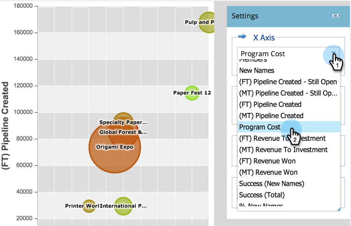

# Compare la eficacia de los Programas con el analizador de Programas {#compare-program-effectiveness-with-the-program-analyzer}

Utilice el analizador de Programas para identificar los programas más y menos efectivos, comparando los costos de programa, la adquisición de miembros, la tramitación y los ingresos.

>[!PREREQUISITES]
>
>* [Creación de un analizador de Programas](create-a-program-analyzer.md)

1. Haga clic en Analytics.

   

1. Seleccione el analizador de Programas.

   

1. Cambie la Vista a Por Programa.

   

1. Utilice el filtro Canal para reducir la vista a uno o dos canales. Por ahora, veremos los programas en el canal de ferias.

   

   >[!TIP]
   >
   >Una forma rápida de filtrar programas a un solo canal es seleccionar **Vista > Por Canal**, hacer clic en la burbuja de ese canal y, a continuación, hacer clic en el nombre del canal en el cuadro de diálogo emergente.

1. Utilice la lista desplegable Eje X para elegir una métrica para el eje horizontal. Inicios con el costo de Programa.

   

1. Utilice la lista desplegable Eje Y para elegir una métrica para el eje vertical. Vamos a elegir Nuevos nombres para encontrar programas que sean buenos para capturar nuevos leads.

   

1. Active los controles deslizantes para aumentar.

   

   >[!TIP]
   >
   >También puede intentar mejorar su vista cambiando de una escala lineal a una logarítmica o viceversa. Utilice el menú **Escala** en la parte superior.

1. Explore el gráfico resultante.

   

   En nuestro ejemplo, aprendemos que la Expo de Origami es mucho mejor que todos los demás programas de ese canal en la captura de nuevos nombres, y a un costo medio. Pero esa no es toda la historia. Agregaremos dos métricas más para comprender mejor.

1. Utilice la lista desplegable Tamaño de burbuja para elegir una métrica que comparar por el tamaño de las burbujas. Elegiremos (FT) Ingresos Ganados para nuestro ejemplo.

   

   >[!NOTE]
   >
   >Muchas de las métricas que puede elegir en el analizador de programa están disponibles con cálculos de primer toque (FT) y de varios toques (MT). Es importante comprender la [diferencia entre la atribución de FT y MT](/help/marketo/product-docs/reporting/revenue-cycle-analytics/revenue-tools/attribution/understanding-attribution.md).

1. Observe el tamaño de las burbujas en el gráfico.

   

   Al agregar **(FT) Ingresos Ganados**, vemos rápidamente que, aunque la Expo de Origami adquirió muchos nombres nuevos, resulta en ingresos comparativamente bajos. Además, vemos que el programa del Festival de Papel 12 está obteniendo menos nombres pero mejores, ya que influye en más ingresos ganados (burbuja mayor).

1. Utilice la lista desplegable Color para agregar una cuarta métrica. Vamos a mirar (FT) Ingresos a la Inversión.

   

1. Observe el cambio de color en el gráfico.

   

Vemos que el programa del Festival de Papel 12 no sólo influye en más ingresos (burbuja mayor), sino que, a pesar de su costo de programa relativamente alto (en el extremo derecho), tiene el mejor retorno a la inversión (burbuja más verde) de todos los programas en el canal de la feria comercial.

>[!TIP]
>
>Puede comparar rápidamente los programas de un canal con los de otro. Utilice el **filtro de Canal** en la parte superior de la ventana para agregar más canales.

>[!MORELIKETHIS]
>
>* [Explorar los detalles de Programa y Canal con el analizador de Programas](explore-program-and-channel-details-with-the-program-analyzer.md)
>* [Comparar la eficacia de los Canales con el analizador de Programas](compare-channel-effectiveness-with-the-program-analyzer.md)

>[!NOTE]
>
>Obtenga más información sobre los análisis avanzados en [Explorador del ciclo de ingresos](https://docs.marketo.com/display/docs/revenue+cycle+analytics).
