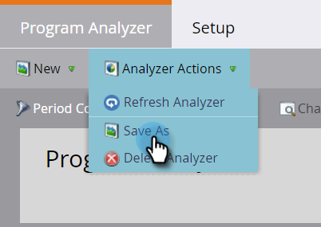

# Crear un analizador de programas {#create-a-program-analyzer}

Descubra qué programas y canales le dan el mayor impulso para su inversión en marketing. Utilice el analizador de programas para examinar y comparar cada coste y cada retorno en detalle, por programa o por canal.

>[!NOTE]
>
>Para obtener buenos datos de un analizador de programas, asegúrese de que sus contactos de CRM tengan roles en las oportunidades y de que los programas de Marketo estén completamente configurados, con [costes de período](/help/marketo/product-docs/reporting/revenue-cycle-analytics/revenue-tools/define-period-costs.md), estados del programa y éxito definido.

>[!TIP]
>
>Para que los programas sin coste aparezcan en el analizador de programas, [establecer su coste de período](/help/marketo/product-docs/reporting/revenue-cycle-analytics/revenue-tools/define-period-costs.md) a $0.

1. Haga clic en el **Analytics** mosaico.

   

1. Haga clic en el **Analizador de programas** mosaico.

   

1. Aparece el analizador de programas estándar. Realice los cambios que necesite.

   

1. Haga clic en el **Configuración** para añadir y personalizar filtros.

   

1. Por ejemplo, para personalizar el filtro Costo de período, haga doble clic en él.

   

1. Seleccione el período de tiempo que desee analizar y haga clic en **Aplicar**.

   

   >[!TIP]
   >
   >Para seleccionar un rango específico, seleccione **Personalizado** y utilice el **De** y **Hasta** campos.

1. Si desea guardar el nuevo analizador personalizado, en la lista desplegable Acciones de analizador , seleccione **Guardar como**.

   

1. Seleccione la ubicación en la que desea guardar el analizador personalizado mediante los menús desplegables Guardar en y Carpeta . Asigne un nombre al nuevo analizador personalizado. Una descripción es opcional. Haga clic en **Guardar**.

   

1. ¡Lo has hecho! Haga clic en la pestaña principal para empezar a explorar y comparar sus programas y canales.

>[!NOTE]
>
>Muchas de las métricas que puede elegir en el analizador de programas están disponibles con cálculos de primer toque (FT) y de varios contactos (MT). Es importante comprender el [diferencia entre la atribución de FT y MT](/help/marketo/product-docs/reporting/revenue-cycle-analytics/revenue-tools/attribution/understanding-attribution.md).

>[!MORELIKETHIS]
>
>* [Comparar la eficacia del canal con el analizador de programas](/help/marketo/product-docs/reporting/revenue-cycle-analytics/program-analytics/compare-channel-effectiveness-with-the-program-analyzer.md)
>* [Comparar la eficacia del programa con el analizador de programas](/help/marketo/product-docs/reporting/revenue-cycle-analytics/program-analytics/compare-program-effectiveness-with-the-program-analyzer.md)
>* [Exploración de los detalles del programa y el canal con el analizador de programas](/help/marketo/product-docs/reporting/revenue-cycle-analytics/program-analytics/explore-program-and-channel-details-with-the-program-analyzer.md)
>* [Clonar un analizador de programas](/help/marketo/product-docs/reporting/revenue-cycle-analytics/program-analytics/clone-a-program-analyzer.md)

