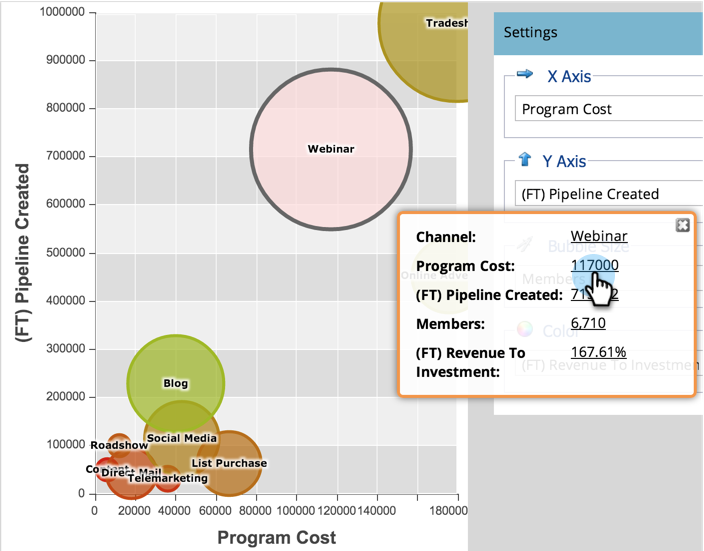

# Explorar los detalles de Programa y Canal con el analizador de Programas {#explore-program-channel-details-with-the-program-analyzer}

Puede ver estadísticas detalladas de programas y canales en el Analizador de Programas. También puede abrirlos en el Explorador de ciclos de ingresos.

>[!PREREQUISITES]
>
>[Creación de un analizador de Programas](/help/marketo/product-docs/reporting/revenue-cycle-analytics/program-analytics/create-a-program-analyzer.md)

>[!AVAILABILITY]
>
>No todas las ediciones de marketing incluyen esta funcionalidad. Póngase en contacto con el administrador de cuentas para obtener más información.

1. Haga clic en **Analytics**.

   

1. Seleccione el analizador de Programas.

   

1. Para ver las estadísticas específicas de un canal o programa (según la **Vista** que seleccione), haga clic en la burbuja correspondiente.

   

   >[!NOTE]
   >
   >Muchas de las métricas que puede elegir en el analizador de programa están disponibles con cálculos de primer toque (FT) y de varios toques (MT). Es importante comprender la [diferencia entre la atribución de FT y MT](/help/marketo/product-docs/reporting/revenue-cycle-analytics/revenue-tools/attribution/understanding-attribution.md).

1. Para comparar todos los programas de un solo canal, haga clic en el nombre del canal en el cuadro de diálogo emergente.

   

1. ¡Ahora puedes comparar los programas individuales dentro de ese canal!

   

   >[!NOTE]
   >
   >Al hacer clic en un solo canal se cambia la vista a Por Programa, filtrada únicamente a ese canal. Para volver a todos los canales, seleccione **Vista** > **Por Canal**.

1. Para abrir el Explorador del ciclo de ingresos para explorar una estadística aún más a fondo, haga clic en ese número en el cuadro de diálogo emergente.

   
