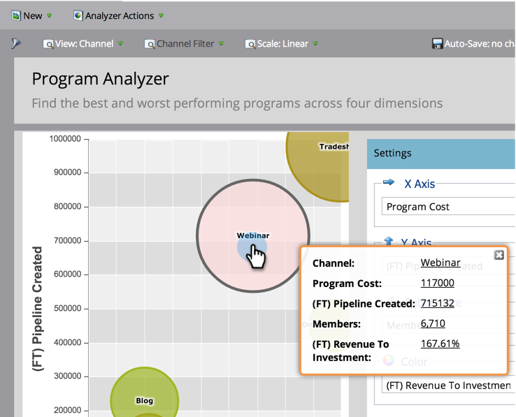

# Explorar los detalles del programa y el canal con [!UICONTROL Analizador de programas] {#explore-program-channel-details-with-the-program-analyzer}

Puede ver estadísticas detalladas de programas y canales en [!UICONTROL Analizador de programas]. También puede abrirlos en el Explorador del ciclo de ingresos.

>[!PREREQUISITES]
>
>[Crear un [!UICONTROL Analizador de programas]](/help/marketo/product-docs/reporting/revenue-cycle-analytics/program-analytics/create-a-program-analyzer.md)

>[!AVAILABILITY]
>
>No todas las ediciones de Marketo incluyen esta funcionalidad. Póngase en contacto con su administrador de cuentas para obtener más información.

1. Haga clic en **[!UICONTROL Analytics]**.

   

1. Seleccione el analizador de programas.

   

1. Para ver las estadísticas específicas de un canal o programa (según la **[!UICONTROL vista]** que seleccione), haga clic en la burbuja correspondiente.

   

   >[!NOTE]
   >
   >Muchas de las métricas que puede elegir en el analizador de programas están disponibles con cálculos de primer toque (FT) y de múltiples contactos (MT). Es importante entender la [diferencia entre la atribución de FTP y MT](/help/marketo/product-docs/reporting/revenue-cycle-analytics/revenue-tools/attribution/understanding-attribution.md).

1. Para comparar todos los programas dentro de un solo canal, haga clic en el nombre del canal en el cuadro de diálogo emergente.

   

1. Ahora puede comparar los programas individuales dentro de ese canal.

   

   >[!NOTE]
   >
   >Al hacer clic en un solo canal, la vista cambia a Por programa, filtrada únicamente a ese canal. Para volver a todos los canales, selecciona **[!UICONTROL Ver]** > **[!UICONTROL Por canal]**.

1. Para abrir el Explorador del ciclo de ingresos y profundizar aún más en una estadística, haga clic en ese número en el cuadro de diálogo emergente.

   
