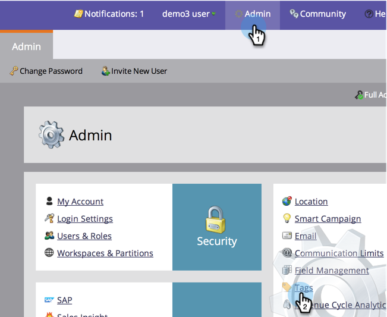

# Hacer que un Programa sin costo de período esté disponible en el Explorador de ingresos y en los analizadores {#make-a-program-without-a-period-cost-available-in-revenue-explorer-and-analyzers}

Los Costos de Período de programa le permiten definir &quot;Cuánto dinero&quot; y &quot;Cuándo&quot; para un programa. Esto se muestra en el Explorador del ciclo de ingresos y [analizadores](/help/marketo/product-docs/reporting/revenue-cycle-analytics/opportunity-influence-analyzer/tell-the-marketing-story-with-an-opportunity-influence-analyzer.md).

>[!NOTE]
>
>**Se requieren permisos de administración**

Es posible que algunos programas deban incluirse incluso si no tienen un costo de período. Aunque puede introducir 0 para el coste del período, hemos facilitado la inclusión de estos programas.

>[!NOTE]
>
>El Analizador de Programas bloquea el éxito de los Programas por costo de período. Si no hay ningún costo de período disponible, el éxito de Programa no se mostrará, independientemente del comportamiento de análisis del programa. Si se configura el comportamiento de análisis, se mostrarán los datos de las métricas de oportunidad (oportunidades de canalización, ingresos obtenidos, etc.).

1. En la sección Administración, haga clic en **Etiquetas**.

   

1. Expanda los Canales y haga clic con el botón doble en el canal que desee.

   >[!NOTE]
   >
   >Todos los programas que utilicen este canal, independientemente del costo del período, estarán disponibles para los exploradores y analizadores de ingresos. Este cambio tendrá efecto al día siguiente.

   

1. Cambie el comportamiento de Analytics a Inclusivo y haga clic en **Guardar**.

   

>[!TIP]
>
>¿Ha notado la opción Operativo? Esto hace lo contrario. Excluye estos programas independientemente del costo del período.

¡Buen trabajo! Ahora cualquier programa que utilice el canal modificado se incluirá en el explorador de ingresos y en los analizadores sin necesidad de un costo de período.

>[!MORELIKETHIS]
>
>[Anular comportamiento de Analytics en el nivel de Programa](/help/marketo/product-docs/reporting/revenue-cycle-analytics/program-analytics/override-analytics-behavior-at-the-program-level.md)
