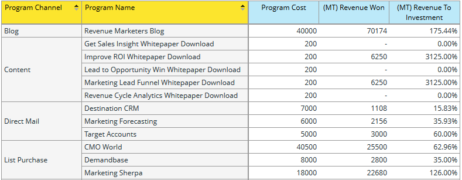

# Explicación del área de Análisis de oportunidades de Programa {#understanding-the-program-opportunity-analysis-area}

## Información general {#overview}

El área de Análisis Oportunidad de Programa le permite analizar la efectividad de Programas individuales o ver resultados resumidos por Canal de Programa.

**Algunas de las preguntas comerciales que puede responder con esta área de análisis son**:

¿Cuántas oportunidades se asociaron a un Programa determinado y cuántas de ellas hemos ganado?

¿Cuántos ingresos ha ayudado a generar un determinado Programa o Canal?

¿Cuáles son los ingresos por inversión para un determinado Programa o Canal?

¿Qué oportunidades influyó un determinado Programa?

## Medidas de atribución de Análisis de oportunidad de programa (puntos azules) {#program-opportunity-analysis-attribution-measures-blue-dots}

Las medidas disponibles para su uso en análisis son generalmente números y están representadas por puntos azules. Los Dimension son atributos que dan diferentes vistas de las medidas y están representados por puntos amarillos.

Todas las medidas (puntos azules) se refieren a la atribución: el &quot;crédito&quot; por adquisición de posibles clientes o por el éxito de ventas asociado a un posible cliente.

 

Existen tres tipos de medidas:

* Medidas relacionadas con la adquisición, que obtienen atribución de primer toque (FT).
* Medidas relacionadas con el éxito, que reciben atribución multitáctil (MT).
* Varias medidas relacionadas con el Programa, incluido el número promedio de toques de mercadotecnia antes de que se creen o cierren las oportunidades.

## Adquisición y medidas relacionadas con el éxito {#acquisition-and-success-related-measures}

Las medidas relacionadas con la adquisición dan crédito al programa a través del cual se obtiene por primera vez la información de contacto de un posible cliente. No es necesario que un posible cliente logre el éxito en un programa de concesión de créditos de adquisición.

El valor de adquirir un posible cliente determinado cambia con el tiempo. Es cero hasta que el posible cliente realiza una compra. Luego puede aumentar con compras adicionales.

Las medidas relacionadas con el éxito dan crédito a todos los programas que contribuyen al progreso de un posible cliente hacia una compra.

Al igual que con la adquisición, el valor de contribuir a las ventas realizadas a un posible cliente cambia con el tiempo y es cero hasta que el posible cliente realiza una compra.

<table> 
 <tbody> 
  <tr> 
   <th>Medida de atribución - Relacionada con la oportunidad (FT o MT)*</th> 
   <th>Descripción</th> 
  </tr> 
  <tr> 
   <td>Costo de oportunidad</td> 
   <td>Parte del costo del programa que influyó en la oportunidad. El costo puede dividirse si hay múltiples posibles clientes implicados.</td> 
  </tr> 
  <tr> 
   <td>Oportunidades creadas</td> 
   <td>Parte del crédito que el programa recibió por influir en la creación de la oportunidad. Puede ser una fracción si hubiera múltiples posibles clientes implicados.</td> 
  </tr> 
  <tr> 
   <td>Oportunidades ganadas</td> 
   <td>Parte del crédito que el programa recibió por influir en la oportunidad que se le presentó. Puede ser una fracción si hubiera múltiples posibles clientes implicados.</td> 
  </tr> 
  <tr> 
   <td>Canalización creada</td> 
   <td>Parte del crédito (en valor monetario) que el programa recibió por influir en la creación de la oportunidad. Puede ser una fracción si hubiera múltiples posibles clientes implicados.</td> 
  </tr> 
  <tr> 
   <td>Canalización creada: aún abierta</td> 
   <td>La parte del crédito (en valor monetario) que el programa recibió por influir en la creación de la oportunidad abierta actual. Puede ser una fracción si hubiera múltiples posibles clientes implicados.</td> 
  </tr> 
  <tr> 
   <td>Ingresos esperados</td> 
   <td>Parte del crédito (en valor monetario) que el programa recibió por influir en la creación de la oportunidad. Ingresos esperados es la probabilidad de oportunidad multiplicada por el valor de oportunidad. Puede ser una fracción si hubiera múltiples posibles clientes implicados.</td> 
  </tr> 
  <tr> 
   <td>Ingresos por inversión</td> 
   <td>Se trata de la proporción de crédito (en valor monetario) que el programa recibió por influir en las oportunidades que se obtuvieron y en el costo del programa.</td> 
  </tr> 
  <tr> 
   <td>Ganancia de ingresos</td> 
   <td>Parte del crédito (en valor monetario) que el programa recibió por influir en su oportunidad. Puede ser una fracción si hubiera múltiples posibles clientes implicados.</td> 
  </tr> 
 </tbody> 
</table>

_* (FT) = Atribución de primer toque, utilizada para medidas de adquisición de plomo; (MT) = Atribución multitáctil, utilizada para medir el éxito de los posibles clientes_

A continuación se muestra un escenario que describe cómo se calculan las unidades de oportunidad cuando hay dos Programas que generaron posibles clientes, pero estos posibles clientes llevaron a una oportunidad desde la misma cuenta.

**Programa 1**

* Genera un lead: Posible cliente 1
* El posible cliente 1 es de la cuenta 1

**Programa 2**

* Genera otro lead: Posible cliente 2
* El posible cliente 2 también es de la cuenta 1

**Cuenta 1**

* Genera una oportunidad: Oportunidad 1

Marketing proporciona crédito de manera adecuada sin oportunidades de recuento de dobles entre Programas. En este caso, cada Programa recibe 0,5 unidades de oportunidad. Es decir, cada Programa recibe la mitad del crédito por la oportunidad generada. Además, la mitad de los ingresos asociados con la oportunidad se asignan a cada Programa.

## Medidas diversas relacionadas con el Programa {#miscellaneous-program-related-measures}

Las demás medidas disponibles reflejan el rendimiento general del Programa.

<table> 
 <tbody> 
  <tr> 
   <th>Medida de atribución - Relacionada con el Programa</th> 
   <th>Descripción</th> 
  </tr> 
  <tr> 
   <td>N.º de oportunidades asociadas con el Programa</td> 
   <td>
Número total de oportunidades que han concedido algún tipo de crédito de atribución a un programa. Las oportunidades pueden verse influidas por uno o más posibles clientes y por uno o más Programas.
</td> 
  </tr> 
  <tr> 
   <td>Promedio de éxitos por oportunidad cerrada</td> 
   <td>El número promedio de éxitos de Programas antes de que se cerrara la oportunidad.  </td> 
  </tr> 
  <tr> 
   <td>Promedio de éxitos por oportunidad creada</td> 
   <td>El número promedio de éxitos de Programas antes de crear la oportunidad.</td> 
  </tr> 
  <tr> 
   <td>Nombres nuevos</td> 
   <td>Número total de nuevos nombres, es decir, nuevos leads, adquiridos por el Programa.</td> 
  </tr> 
  <tr> 
   <td>Costo de programa</td> 
   <td>Coste total del Programa.</td> 
  </tr> 
  <tr> 
   <td>Éxito (total)</td> 
   <td>Número total de miembros del Programa que lograron el éxito.</td> 
  </tr> 
 </tbody> 
</table>

## Dimension de Análisis de oportunidad de programa (puntos amarillos) {#program-opportunity-analysis-dimensions-yellow-dots}

Mientras que las medidas (puntos azules) se calculan y requieren cierta reflexión y explicación para su uso, las dimensiones (puntos amarillos) son descriptivas. Estas son las dimensiones disponibles.

<table> 
 <tbody> 
  <tr> 
   <th>Categoría</th> 
   <th>Mostrar etiqueta</th> 
  </tr> 
  <tr> 
   <td>Atributos de oportunidad</td> 
   <td>Oportunidad cerrada Nombre de oportunidad* Nombre de propietario de oportunidad Fase de oportunidad Tipo de oportunidad</td> 
  </tr> 
  <tr> 
   <td>Intervalo de tiempo de oportunidad</td> 
   <td>Oportunidad año/trimestre/mes cerrado Oportunidad creada año/trimestre/mes</td> 
  </tr> 
  <tr> 
   <td>Atributos de programa</td> 
   <td>Canal de programa Nombre de Programa</td> 
  </tr> 
  <tr> 
   <td>Intervalo de tiempo de costo de programa</td> 
   <td>Año/Trimestre/Mes de costo</td> 
  </tr> 
 </tbody> 
</table>

**Todas las Oportunidades que dieron cualquier tipo de crédito de atribución a un Programa. Las oportunidades pueden estar influidas por uno o más posibles clientes y por uno o más Programas.*

>[!MORELIKETHIS]
>
>[Crear un informe del Explorador de ingresos](/help/marketo/product-docs/reporting/revenue-cycle-analytics/revenue-explorer/create-a-revenue-explorer-report.md)
