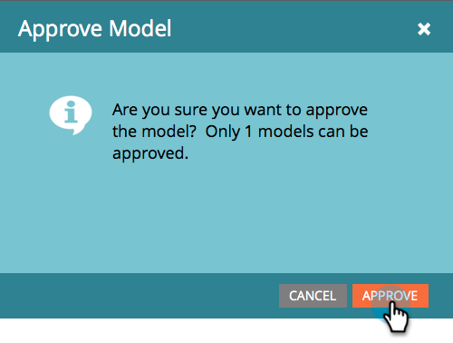

# Aprobar/desaprobar un modelo de ingresos {#approve-unapprove-a-revenue-model}

Solo puede tener un modelo aprobado en un momento dado.

>[!CAUTION]
>
>[Las etapas individuales deben aprobarse](/help/marketo/product-docs/reporting/revenue-cycle-analytics/revenue-cycle-models/approving-stages-and-assigning-leads-to-a-revenue-model.md) y personas agregadas antes de aprobar un modelo completo.

## Aprobar {#approve}

1. Vaya a la **Analytics** .

   

1. Seleccione un modelo del árbol.

   

1. En el **Acciones de modelo** , elija **Aprobar modelo**.

   

1. Aparecerá un cuadro de diálogo para confirmar la elección. Haga clic en **Aprobar**.

   

¡Tu modelo ya está en vivo!

## Desaprobar {#unapprove}

>[!CAUTION]
>
>Si desapruebas tu modelo, todas tus personas son eliminadas del modelo, ¡y su historial en el modelo es borrado!

1. Vaya a la **Analytics** .

   

1. Seleccione un modelo del árbol.

   

1. Haga clic en el **Acciones de modelo** y seleccione **Desaprobar modelo**.

   

1. En el cuadro de diálogo que aparece, haga clic en **Desaprobar modelo**.

   

¡Felicidades! El modelo ya no está aprobado.

>[!CAUTION]
>
>Al desaprobar un modelo, se eliminan todas las personas del modelo y se elimina su historial en el modelo de la base de datos.
