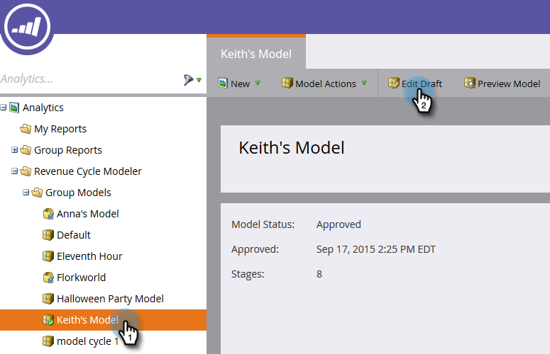
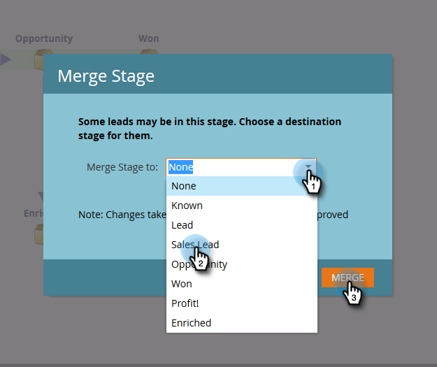
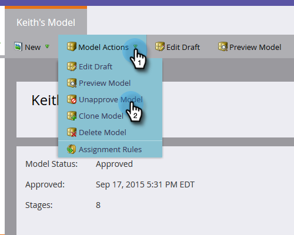

# Edición del modelo aprobado {#editing-your-approved-model}

## Edición del modelo {#editing-your-model}

1. Seleccione el modelo al que desea realizar cambios en la sección [!UICONTROL Analytics] y haga clic en **[!UICONTROL Editar borrador]**.

   

1. No se pueden eliminar fases al editar un modelo de borrador (una vez aprobado el modelo). En su lugar, puede combinar esa fase con otra del modelo. Haga clic con el botón derecho en la etapa que desee combinar y haga clic en **[!UICONTROL Combinar]**.

   

1. Elija la nueva etapa para los posibles clientes que estén actualmente en la etapa seleccionada, o bien seleccione **[!UICONTROL Ninguno]** para eliminar los posibles clientes del modelo. Cuando haya terminado, haga clic en **[!UICONTROL Combinar]**.

   

1. Cuando haya terminado de realizar cambios en el modelo, vuelva a aprobarlo seleccionando **[!UICONTROL Aprobar borrador de modelo]** en el menú **[!UICONTROL Acciones de modelo]**.

   

   >[!TIP]
   >
   >Si realiza cambios en las fases, como agregarlas o combinarlas, asegúrese de cambiar las [!UICONTROL reglas de asignación] y las fases para reflejar las ediciones.

## Desaprobación del modelo {#unapproving-your-model}

>[!CAUTION]
>
>Si desaprueba el modelo, se eliminarán todos sus posibles clientes y se eliminará su historial en el modelo. Considere la posibilidad de editar el modelo en lugar de desaprobarlo.

1. Seleccione el modelo que desea desaprobar. En el menú **[!UICONTROL Acciones de modelo]**, seleccione **[!UICONTROL Desaprobar modelo]**.

   

1. Haga clic en **[!UICONTROL Desaprobar]**.

   

>[!NOTE]
>
>Si desea volver a aprobar este modelo, primero deberá reasignar los posibles clientes a las fases.

## Creación de más modelos {#creating-more-models}

Solo se puede tener un modelo aprobado a la vez. Si desea aprobar un modelo pero ya tiene uno aprobado, primero debe desaprobar el modelo actual. Si es posible, intente editar el modelo en lugar de crear uno nuevo.

>[!MORELIKETHIS]
>
>[Crear un nuevo modelo de ingresos](/help/marketo/product-docs/reporting/revenue-cycle-analytics/revenue-cycle-models/create-a-new-revenue-model.md)
