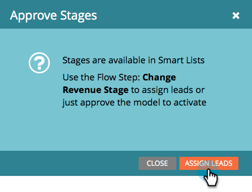
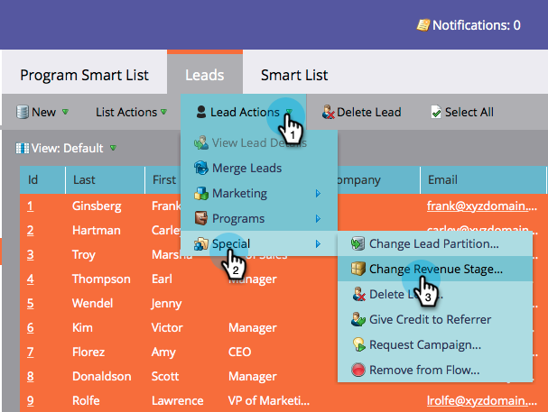

# Aprobación de etapas y asignación de posibles clientes a un modelo de ingresos {#approving-stages-and-assigning-leads-to-a-revenue-model}

Ponga en marcha el **Modelo de ingresos** agregando leads existentes, creando reglas de asignación para posibles clientes nuevos.

## Aprobación de etapas {#approving-stages}

Aprobemos las etapas del modelo antes de agregar posibles clientes.

1. Vaya al área **Analytics**.

   

1. Seleccione el modelo cuyas etapas desee aprobar.

   

1. En **Acciones de modelo**, seleccione **Aprobar etapas**.

   

1. Te recibirán con una alerta; haga clic en **Asignar leads**.

   

¡Excelente! Sigamos y asignemos esos leads.

## Asignación de leads existentes {#assigning-existing-leads}

[Cree una ](/help/marketo/product-docs/core-marketo-concepts/smart-lists-and-static-lists/creating-a-smart-list/create-a-smart-list.md) lista inteligente para identificar los leads de una etapa del modelo en la base de datos de posibles clientes.

1. Una vez que haya [creado la Lista inteligente](/help/marketo/product-docs/core-marketo-concepts/smart-lists-and-static-lists/creating-a-smart-list/create-a-smart-list.md), haga clic en la ficha **Posibles clientes**.

   

1. Haga clic en **Seleccionar todo** para seleccionar los leads.

   

1. Abra la lista desplegable **Acciones de posibles clientes** y seleccione **Especial**. Haga clic en **Cambiar etapa de ingresos**.

   

1. Seleccione el **modelo** correcto y el **escenario** correcto. Haga clic en **Ejecutar ahora**.

   

1. Repita el proceso hasta que todos los leads se asignen a las distintas etapas del modelo.

¡bueno! Para especificar cómo se asignan nuevos leads a las fases, cree reglas de asignación.

>[!NOTE]
>
>Si el modelo está en el estado Fases aprobadas, no verá ningún evento de la etapa de cambio de ingresos en los registros de actividades de leads. Si el modelo está totalmente aprobado, este paso de flujo se omitirá si mueve un lead a la misma etapa en la que se encuentra actualmente.

## Nuevos leads: Crear reglas de asignación {#new-leads-create-assignment-rules}

1. Haga clic de nuevo en **Inicio de marketing** y seleccione **Analytics**.

   

1. Haga clic en el modelo en el árbol y, a continuación, en el menú **Acciones del modelo**, seleccione **Reglas de asignación**.

   

1. Si las reglas de asignación contienen más de una opción predeterminada, haga clic en **Escenario**, realice la selección y haga clic en **Añadir opción**.

   

## Ejemplo de regla de asignación {#example-assignment-rule}

Cree una regla de Puntuación de posible cliente para asignar los nuevos leads con una puntuación mínima a un paso adecuado.

1. En **Si**, seleccione **Puntuación de posible cliente**. A continuación, elija **al menos**.

   

1. Escriba **40** en el campo y seleccione **Líder de ventas** como una etapa. Haga clic en **Guardar** para completar.

   

>[!MORELIKETHIS]
>
>Para aprobar su modelo, lea nuestra página de ayuda en **[Aprobación y desaprobación de un modelo de ingresos](/help/marketo/product-docs/reporting/revenue-cycle-analytics/revenue-cycle-models/approve-unapprove-a-revenue-model.md)**.
