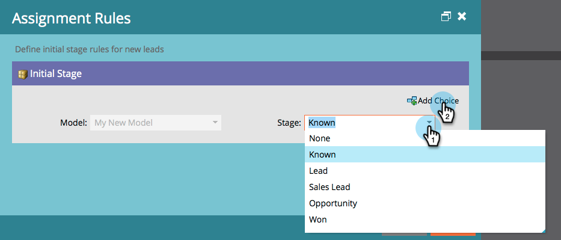

# Aprobación de etapas y asignación de posibles clientes a un modelo de ingresos {#approving-stages-and-assigning-leads-to-a-revenue-model}

Obtenga su **Modelo de ingresos** para su ejecución, agregue posibles clientes existentes y cree reglas de asignación para cualquier posible cliente nuevo.

## Aprobación de etapas {#approving-stages}

Aprobemos las etapas del modelo antes de agregar posibles clientes.

1. Vaya a la **Analytics** .

   

1. Seleccione el modelo cuyas etapas desee aprobar.

   

1. En **Acciones de modelo**, seleccione **Aprobar etapas**.

   

1. Te recibirán con una alerta; click **Asignar posibles clientes**.

   

¡Excelente! Sigamos y asignemos esos posibles clientes.

## Asignación de posibles clientes existentes {#assigning-existing-leads}

[Crear una lista inteligente](/help/marketo/product-docs/core-marketo-concepts/smart-lists-and-static-lists/creating-a-smart-list/create-a-smart-list.md) para identificar los posibles clientes para una etapa del modelo en la base de datos de posibles clientes.

1. Una vez que haya [crear la lista inteligente](/help/marketo/product-docs/core-marketo-concepts/smart-lists-and-static-lists/creating-a-smart-list/create-a-smart-list.md), haga clic en **Posibles clientes** pestaña .

   

1. Haga clic en **Seleccionar todo** para seleccionar los posibles clientes.

   

1. Abra el **Acciones de posible cliente** y seleccione **Especial**. Haga clic en **Etapa de cambio de ingresos**.

   

1. Seleccione el **Modelo** y la **Prueba**. Haga clic en **Ejecutar ahora**.

   

1. Repita el proceso hasta que todos los posibles clientes se asignen a las distintas etapas del modelo.

¡Excelente! Para especificar cómo se asignan nuevos posibles clientes a las etapas, cree reglas de asignación.

>[!NOTE]
>
>Si el modelo se encuentra en el estado Etapas aprobadas , no verá ningún evento de Etapa de cambio de ingresos en los registros de actividad de los posibles clientes. Si el modelo está totalmente aprobado, este paso de flujo se omitirá si mueve un posible cliente a la misma etapa en la que se encuentra actualmente.

## Nuevos posibles clientes: Crear reglas de asignación  {#new-leads-create-assignment-rules}

1. Haga clic en **Página principal de Marketo** de nuevo y, a continuación, seleccione **Analytics**.

   

1. Haga clic en el modelo en el árbol y luego en la variable **Acciones de modelo** menú, seleccionar **Reglas de asignación**.

   

1. Si las reglas de asignación contienen más de una opción predeterminada, haga clic en **Prueba**, realice la selección y haga clic en **Agregar opción**.

   

## Ejemplo de regla de asignación {#example-assignment-rule}

Cree una regla de Puntuación de posible cliente para asignar los nuevos posibles clientes con una puntuación mínima a un paso adecuado.

1. En **If**, seleccione **Puntuación de posible cliente**. A continuación, elija **al menos**.

   

1. Entrar **40** en el campo y seleccione **Cliente potencial de ventas** como escenario. Haga clic en **Guardar** para completar.

   

>[!MORELIKETHIS]
>
>Para aprobar el modelo, lea nuestra página de ayuda en **[Aprobación y desaprobación de un modelo de ingresos](/help/marketo/product-docs/reporting/revenue-cycle-analytics/revenue-cycle-models/approve-unapprove-a-revenue-model.md)**.
