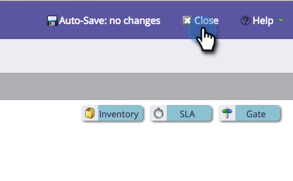

# Cambio del nombre de una fase {#changing-the-name-of-a-stage}

¿Cambiar de opinión? No hay problema. Cambiar el nombre de una etapa en el modelador de ciclo de ingresos es fácil.

1. Vaya al área de **[!UICONTROL Analytics]**.

   

1. Seleccione un modelador de ciclo de ingresos para actualizar. Haga clic en **[!UICONTROL Editar borrador]**.

   

1. Seleccione la fase que desee actualizar e introduzca un nuevo **[!UICONTROL Nombre]**.

   

1. Haga clic en **[!UICONTROL Cerrar]**.

   

   ¿Ves? ¡Tranquilo! Recuerde [Aprobar el modelo](/help/marketo/product-docs/reporting/revenue-cycle-analytics/revenue-cycle-models/approve-unapprove-a-revenue-model.md).
