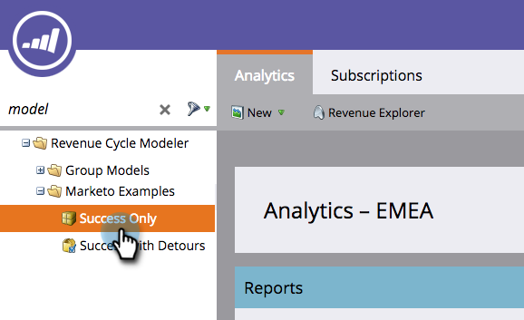
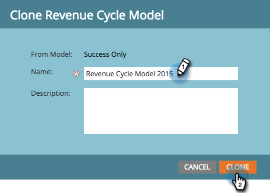

# Clonación de un modelo de ingresos de ejemplo de Marketo {#cloning-a-marketo-example-revenue-model}

Marketo tiene modelos de ingresos de ejemplo que le ayudarán a inspirarle. Clona estos modelos y hazlos suyos. Así es como:

1. Vaya a la **Analytics** .

   

1. Select **Modelador de ciclo de ingresos** carpeta y haga clic en **Ejemplos de Marketo**.

   

1. Elija uno de los modelos.

   

1. En Acciones de modelo, seleccione **Modelo de clonación**.

   

1. Escriba un **Nombre** y haga clic en **Clonar**.

   

   ¡Si solo la generación de ingresos fuera tan fácil!
