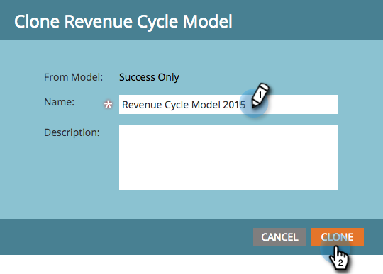

# Clonación de un modelo de ingresos de ejemplo de Marketo {#cloning-a-marketo-example-revenue-model}

Marketo tiene modelos de ingresos de ejemplo que le ayudarán a inspirarse. Clona estos modeladores y haz que sean tuyos. A continuación se muestra cómo:

1. Vaya al área de **[!UICONTROL Analytics]**.

   

1. Seleccione la carpeta **[!UICONTROL Revenue Cycle Modeler]** y haga clic en **[!UICONTROL Ejemplos de Marketo]**.

   

1. Elija uno de los modeladores.

   

1. De [!UICONTROL Acciones de modelo], seleccione **[!UICONTROL Clonar modelo]**.

   

1. Escriba un **[!UICONTROL Nombre]** y haga clic en **[!UICONTROL Clonar]**.

   

   ¡Ojalá generar ingresos fuera tan fácil!
