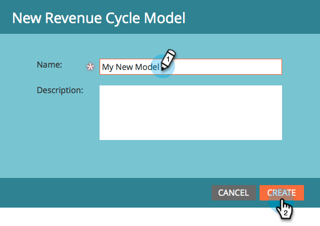
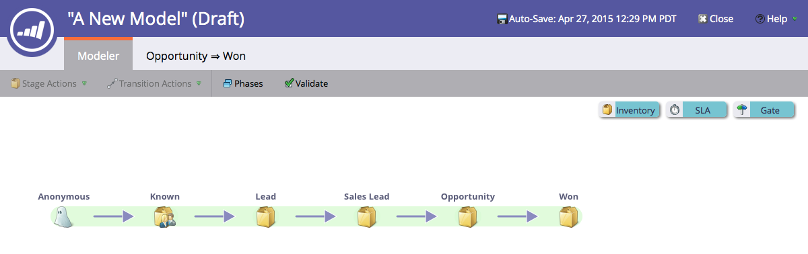

# Crear un nuevo modelo de ingresos {#create-a-new-revenue-model}

1. Para crear un nuevo modelo de ciclo de ingresos, haga clic en el botón **Analytics** en la pantalla de inicio Mi marketing.

   

1. En la ficha **Analytics**, haga clic en **Nuevo** y seleccione **Nuevo modelo de ciclo de ingresos**.

   

1. Aparece una ventana modal **Nuevo modelo de ciclo de ingresos**. Escriba un nombre y haga clic en **Crear**.

   

1. Haga clic en **Editar borrador** en la vista principal del modelo.

   

1. En la nueva ventana, se le presentará un modelo con seis etapas de inventario, cinco transiciones entre estas etapas y la capacidad de agregar etapas de inventario, SLA y puerta.

   

¡Se ve afilado! Acaban de entrar en el maravilloso mundo del modelado.

>[!MORELIKETHIS]
>
>Obtenga más información sobre [Uso de las etapas de inventario del modelo de ingresos](/help/marketo/product-docs/reporting/revenue-cycle-analytics/revenue-cycle-models/using-revenue-model-inventory-stages.md).
