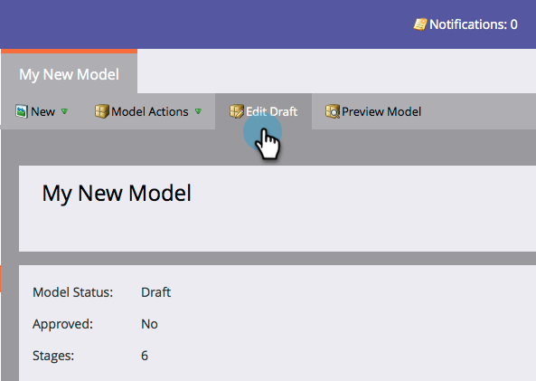

# Crear un nuevo modelo de ingresos {#create-a-new-revenue-model}

1. Para crear un nuevo modelo del ciclo de ingresos, haz clic en el botón **[!UICONTROL Analytics]** en la pantalla de inicio de [!UICONTROL Mi Marketo].

   

1. En la ficha **[!UICONTROL Analytics]**, haga clic en **[!UICONTROL Nuevo]** y seleccione **[!UICONTROL Nuevo modelo de ciclo de ingresos]**.

   

1. Aparece una ventana modal **[!UICONTROL Nuevo modelo de ciclo de ingresos]**. Escriba un nombre y haga clic en **[!UICONTROL Crear]**.

   

1. Haga clic en **[!UICONTROL Editar borrador]** en la vista de inicio del modelo.

   

1. En la nueva ventana, se le presentará un modelo con seis etapas de inventario, 5 transiciones entre estas etapas y la capacidad de añadir etapas de inventario, SLA y puerta.

   

¡Luce afilado! Acabas de entrar en el maravilloso mundo del modelado.

>[!MORELIKETHIS]
>
>Más información acerca de [Usar etapas de inventario del modelo de ingresos](/help/marketo/product-docs/reporting/revenue-cycle-analytics/revenue-cycle-models/using-revenue-model-inventory-stages.md).
