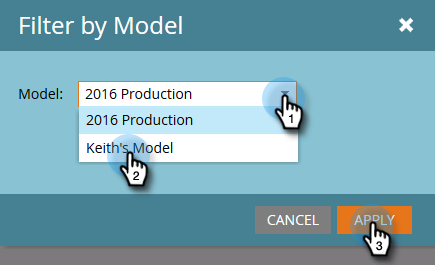

# Crear un analizador de rutas de éxito {#create-a-success-path-analyzer}

Obtenga una representación visual de la velocidad y el flujo a través del modelo de ciclo de ingresos.

>[!PREREQUISITES]
>
>[Crear un nuevo modelo de ingresos](/help/marketo/product-docs/reporting/revenue-cycle-analytics/revenue-cycle-models/create-a-new-revenue-model.md)

1. Haga clic en el mosaico **Analytics**.

   

1. Haga clic en el icono **Analizador de rutas de éxito**.

   

   >[!NOTE]
   >
   >Si recibe una advertencia de que no se encontraron datos en el intervalo de tiempo especificado, haga clic en **Cerrar** para cambiar el intervalo de tiempo. Si no se le solicita, pero desea cambiar el intervalo de tiempo, vaya a **Configuración** y haga clic con el botón de doble **Intervalo de tiempo**.

1. Si no tiene datos o está cambiando el intervalo de tiempo, seleccione uno en la lista desplegable y haga clic en Guardar.

   

   >[!TIP]
   >
   >Para seleccionar un intervalo específico, seleccione **Personalizado** y utilice los campos **De** y **A**.

1. Si tiene más de un modelo de ciclo de ingresos, seleccione el que desee en la ficha **Configuración**.

   

1. Elija el modelo apropiado y haga clic en **Aplicar**.

   

1. Haga clic en la ficha **Analizador de rutas de éxito**.

   

Ahora puede explorar el movimiento de cada etapa al siguiente.

>[!TIP]
>
>¿Desea guardar el informe? Haga clic en la lista desplegable **Acciones del analizador** y seleccione **Guardar como**.

>[!MORELIKETHIS]
>
>[Uso del analizador de rutas de éxito](/help/marketo/product-docs/reporting/revenue-cycle-analytics/revenue-cycle-models/using-the-success-path-analyzer.md)
