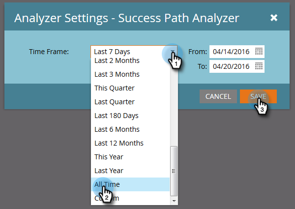

# Creación de un analizador de rutas de éxito {#create-a-success-path-analyzer}

Obtenga una representación visual de la velocidad y el flujo a través del modelo del ciclo de ingresos.

>[!PREREQUISITES]
>
>[Crear un nuevo modelo de ingresos](/help/marketo/product-docs/reporting/revenue-cycle-analytics/revenue-cycle-models/create-a-new-revenue-model.md)

1. Haga clic en el mosaico **[!UICONTROL Analytics]**.

   

1. Haga clic en el icono **[!UICONTROL Analizador de rutas de éxito]**.

   

   >[!NOTE]
   >
   >Si recibe la advertencia de que no se encontraron datos en el lapso de tiempo especificado, simplemente haga clic en **[!UICONTROL Cerrar]** para cambiar el lapso de tiempo. Si no se le solicita, pero desea cambiar el lapso de tiempo, vaya a **[!UICONTROL Configuración]** y haga doble clic en **[!UICONTROL Periodo de tiempo]**.

1. Si no tenías datos o estás cambiando tu lapso de tiempo, selecciona uno de la lista desplegable y haz clic en **[!UICONTROL Guardar]**.

   

   >[!TIP]
   >
   >Para seleccionar un rango específico, seleccione **[!UICONTROL Personalizado]** y use los campos **[!UICONTROL De]** y **[!UICONTROL A]**.

1. Si tiene más de un modelo de ciclo de ingresos, seleccione el que desee en la ficha **[!UICONTROL Configuración]**.

   

1. Elija el modelo apropiado y haga clic en **[!UICONTROL Aplicar]**.

   

1. Haga clic en la ficha **[!UICONTROL Analizador de rutas de éxito]**.

   

Ahora puede explorar el movimiento de cada etapa a la siguiente!

>[!TIP]
>
>¿Desea guardar el informe? Haga clic en el menú desplegable **[!UICONTROL Acciones del analizador]** y seleccione **[!UICONTROL Guardar como]**.

>[!MORELIKETHIS]
>
>[Uso del analizador de rutas de éxito](/help/marketo/product-docs/reporting/revenue-cycle-analytics/revenue-cycle-models/using-the-success-path-analyzer.md)
