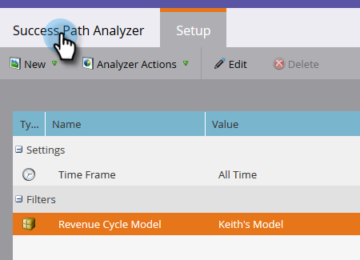

# Creación de un analizador de rutas de éxito {#create-a-success-path-analyzer}

Obtenga una representación visual de la velocidad y el flujo a través del modelo [de ciclo de](http://docs.marketo.com/display/docs/revenue+cycle+analytics)ingresos.

>[!NOTE]
>
>**Requisitos previos**
>
>[Crear un nuevo modelo de ingresos](create-a-new-revenue-model.md)

1. Haga clic en el mosaico de Analytics.

   

1. Haga clic en el icono Analizador de rutas de éxito.

   

   >[!NOTE]
   >
   >Si recibe una advertencia de que no se encontraron datos en el intervalo de tiempo especificado, haga clic en **Cerrar** para cambiar el intervalo de tiempo. Si no se le solicita, pero desea cambiar el intervalo de tiempo, vaya a **Configuración** y haga clic con el botón de doble** ****Intervalo** de tiempo.

1. Si no tiene datos o está cambiando el intervalo de tiempo, seleccione uno en la lista desplegable y haga clic en Guardar.

   

   >[!TIP]
   >
   >Para seleccionar un rango específico, seleccione **Personalizado** y utilice los campos **Desde** y **Hasta** .

1. Si tiene más de un modelo de ciclo de ingresos, seleccione el que desee en la ficha Configuración.

   

1. Elija el modelo adecuado y haga clic en Aplicar.

   

1. Haga clic en la ficha Analizador de rutas de éxito.

   

Ahora puede explorar el movimiento de cada etapa al siguiente.

>[!TIP]
>
>¿Desea guardar el informe? Haga clic en la lista desplegable Acciones **del** analizador y seleccione **Guardar como**.

>[!NOTE]
>
>**Artículos relacionados**
>
>* [Uso del analizador de rutas de éxito](using-the-success-path-analyzer.md)

>

