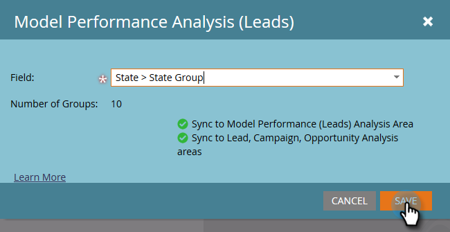

# Habilitar grupos de campos personalizados para el análisis de rendimiento del modelo (posibles clientes) {#enable-custom-field-groups-for-model-performance-analysis-leads}

>[!PREREQUISITES]
>
>Categorice los campos estándar o personalizados en grupos para crear informes a través del Organizador de campos en Marketo. Para obtener más información, consulte [Creación de grupos de campos personalizados mediante el organizador de campos](/help/marketo/product-docs/reporting/revenue-cycle-analytics/revenue-tools/field-organizers/create-custom-field-groups-using-the-field-organizer.md).

<table> 
 <tbody> 
  <tr> 
   <td colspan="3" rowspan="1">
<strong>¿Cómo afecta la activación de un grupo de campos personalizados a varias áreas de análisis en el Explorador de ciclos de ingresos?</strong>
</td> 
  </tr> 
  <tr> 
   <td colspan="1" rowspan="1">
<strong>¿Qué pasa cuando...?</strong>
</td> 
   <td colspan="1" rowspan="1">
<strong>Impacto en el área de análisis de rendimiento del modelo (posibles clientes)</strong>
</td> 
   <td colspan="1" rowspan="1">
<strong>Impacto en las áreas de análisis de posibles clientes, análisis de campañas y análisis de oportunidades</strong>
</td> 
  </tr> 
  <tr> 
   <td colspan="1" rowspan="1">
<strong>¿Qué sucede cuando se habilita un grupo de campos personalizados asociado a un campo de posible cliente o de empresa estándar?</strong>
</td> 
   <td colspan="1" rowspan="1">
El grupo de campos personalizados está habilitado para la creación de informes en el área de análisis de rendimiento del modelo (posibles clientes)
</td> 
   <td colspan="1" rowspan="1">
Sin impacto
</td> 
  </tr> 
  <tr> 
   <td colspan="1" rowspan="1">
<strong>¿Qué sucede cuando se habilita un grupo de campos personalizados asociado a un campo personalizado de persona o compañía?</strong>
</td> 
   <td colspan="1" rowspan="1">
El grupo de campos personalizados está habilitado para la creación de informes en el área de análisis de rendimiento del modelo (posibles clientes)
</td> 
   <td colspan="1" rowspan="1">
El campo personalizado en sí está habilitado para la creación de informes en las áreas de análisis de posibles clientes, análisis de campaña y análisis de oportunidad.

<strong>NOTA:</strong> Los grupos de campos personalizados NO son compatibles con estas áreas de análisis, por lo que las asociaciones de grupos no se muestran en el Explorador de ciclos de ingresos:<em>solamente</em> el campo personalizado.
</td> 
  </tr> 
 </tbody> 
</table>

Siga estos pasos para habilitar un grupo de campos personalizados para la creación de informes en el área Análisis de rendimiento de modelo (posibles clientes).

1. Clic **Administrador**.

   

1. Clic **Análisis del ciclo de ingresos**.

   

1. Clic **Ninguno** junto a un grupo de campos vacío. Si ya tiene tres grupos de campos habilitados y desea realizar una edición, haga clic en el nombre del grupo de campos que desee modificar.

   

1. Haga clic en **Campo** y seleccione el que desee.

   

   >[!NOTE]
   >
   >En este ejemplo se habilitó un grupo de campos personalizados para un campo estándar (Estado). Por lo tanto, solo se vio afectada el área de Análisis de rendimiento del modelo (posibles clientes). Si se hubiera habilitado un grupo de campos personalizados para un campo de persona o empresa personalizado, el grupo habilitado se mostraría en la sección Análisis de rendimiento del modelo (posibles clientes) de la pestaña Resumen de sincronización y el recuento de campos personalizados para Análisis de posibles clientes, Campaña y oportunidad aumentaría en uno.

1. Clic **Guardar**.

   
