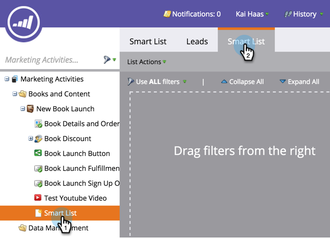
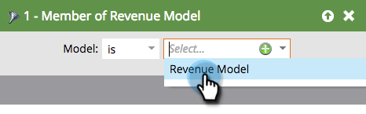

# Buscar todos los posibles clientes en un modelo del ciclo de ingresos {#find-all-leads-in-a-revenue-cycle-model}

Mediante listas inteligentes, puede encontrar fácilmente todos los miembros del modelo de ciclo de ingresos.

>[!PREREQUISITES]
>
>[Crear una lista inteligente](/help/marketo/product-docs/core-marketo-concepts/smart-lists-and-static-lists/creating-a-smart-list/create-a-smart-list.md)

1. Con la lista inteligente seleccionada, haga clic en la ficha **[!UICONTROL Lista inteligente]**.

   

1. Busque el filtro **[!UICONTROL Miembro del modelo de ingresos]** y arrástrelo al lienzo.

   

1. Seleccionar un **[!UICONTROL modelo]**.

   

   Esto le daría todos los posibles clientes de ese modelo, independientemente del escenario. Por lo general, usted querrá una etapa específica. Utilice el siguiente filtro en su lugar.

1. Busque el filtro **[!UICONTROL Ingreso Stage]** y arrástrelo al lienzo.

   

1. Seleccione un **[!UICONTROL escenario]**.

   

1. Vaya a la pestaña **[!UICONTROL Posibles clientes]** para ver los resultados.

   

   >[!TIP]
   >
   >No necesita ambos filtros, solo elija el que necesita. Solo les estamos mostrando a ambos que sean minuciosos.

   >[!CAUTION]
   >
   >Si una campaña externa cambia la fase de un posible cliente durante la creación inicial de este, la actividad no se registra en la base de datos. Esto significa que el posible cliente no se incluirá en el filtro de lista inteligente.
