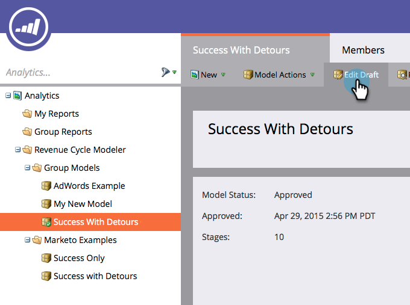

# Combinación de dos etapas en el modelador de ingresos {#merging-two-stages-in-the-revenue-modeler}

Una vez aprobado el modelo, no se pueden eliminar etapas al editar un borrador. En su lugar, puede combinar ese escenario con otro.

1. Haga clic en **Inicio de marketing** y seleccione **Analytics**.

   

1. Haga clic en el modelo aprobado.

   

1. Haga clic en **Editar borrador.**

   

1. Haga clic con el botón derecho en el escenario que desee combinar y seleccione **Combinar escenario** en el menú.

   

1. Haga clic en la etapa específica de la lista desplegable.

   

1. Puede volver a aprobar el modelo seleccionando **Aprobar borrador del modelo** en el menú **Acciones del modelo**.

   

>[!NOTE]
>
>Elija **Ninguno** en la lista desplegable de la etapa de combinación para eliminar los leads del modelo
