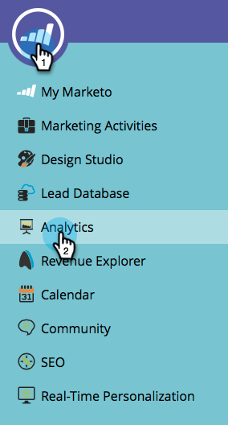
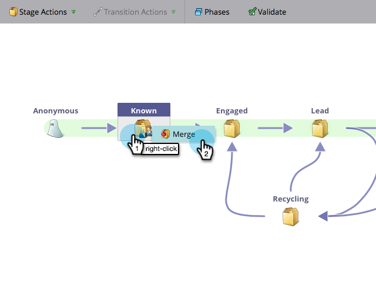
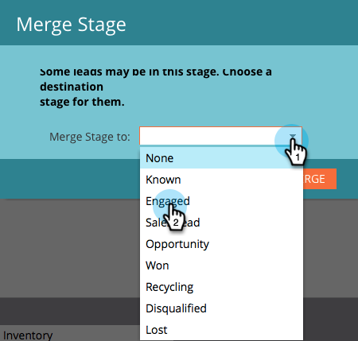

# Combinación de dos fases en el modelador de ingresos {#merging-two-stages-in-the-revenue-modeler}

Una vez aprobado el modelo, no se pueden eliminar fases al editar un borrador. En su lugar, puede combinar esa etapa con otra.

1. Haga clic en **Inicio de Marketo** y seleccione **[!UICONTROL Analytics]**.

   

1. Haga clic en el modelo aprobado.

   

1. Haga clic en **[!UICONTROL Editar borrador.]**

   

1. Haga clic con el botón derecho en la fase que desee combinar y seleccione **[!UICONTROL Combinar] fase** en el menú.

   

1. Haga clic en el escenario específico en la lista desplegable.

   

1. Puede volver a aprobar el modelo seleccionando **[!UICONTROL Aprobar borrador de modelo]** en el menú **[!UICONTROL Acciones de modelo]**.

   

>[!NOTE]
>
>Elija **[!UICONTROL Ninguno]** en la extracción de [!UICONTROL Fase de combinación] para eliminar los posibles clientes del modelo
