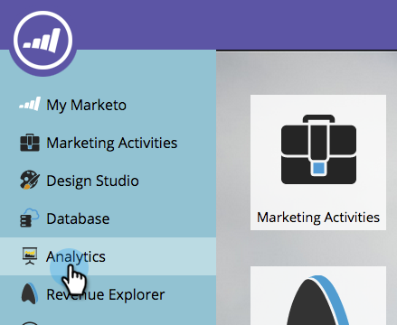

# Informe sobre el modelo de ingresos {#report-on-your-revenue-model}

Para cada modelo de ciclo de ingresos, puede generar un informe sobre cuántos posibles clientes hay en cada etapa.

>[!NOTE]
>
>Los posibles clientes deben ser miembros del modelo que se incluirá en el informe.

1. Vaya a **Analytics**.

   

1. Haga clic en **Posibles clientes por etapa de ingresos**.

   

1. Haga clic en la ficha **Configuración** y, a continuación, debajo de la sección de filtro, haga clic con el doble **Modelo de ciclo de ingresos**.

   

1. Seleccione el **Modelo** aprobado.

   

   >[!NOTE]
   >
   >Para que esté disponible en este menú desplegable, el modelo debe aprobarse o al menos tener fases aprobadas.

1. Haga clic en la ficha **Informe** para ver cuántos posibles clientes hay en cada etapa del modelo de ciclo de ingresos.

   

¿Por qué esto es útil? El modelo muestra el canal de ventas y marketing. Realice un seguimiento de sus saldos con el tiempo para identificar los cuellos de botella antes de que se conviertan en un problema.
