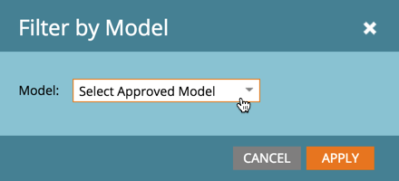

# Informe sobre el modelo de ingresos {#report-on-your-revenue-model}

Para cada modelo del ciclo de ingresos, puede generar un informe sobre cuántos posibles clientes hay en cada fase.

>[!NOTE]
>
>Los posibles clientes deben ser miembros del modelo para que se incluyan en el informe.

1. Ir a **Analytics**.

   

1. Clic **Posibles clientes por fase de ingresos**.

   

1. Haga clic en **Configurar** y, debajo de la sección de filtro, haga doble clic en **Modelo del ciclo de ingresos**.

   

1. Seleccione el aprobado **Modelo**.

   

   >[!NOTE]
   >
   >Para estar disponible en este menú desplegable, el modelo debe estar aprobado o, al menos, tener etapas aprobadas.

1. Haga clic en **Informe** para ver cuántos posibles clientes hay en cada fase del modelo del ciclo de ingresos.

   

¿Por qué es útil esto? El modelo muestra su canal de ventas y marketing. Realice un seguimiento de sus balances a lo largo del tiempo para identificar cuellos de botella antes de que se conviertan en un problema.
