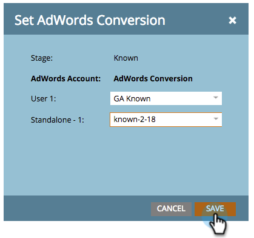

# Configure las conversiones de Google AdWords en el modelo de ingresos con una cuenta de administrador {#set-google-adwords-conversions-in-the-revenue-model-with-a-manager-account}

Vincule su cuenta de Google AdWords a Marketing para cargar automáticamente datos de conversión sin conexión de Marketing a Google AdWords. Luego, desde la interfaz de usuario de AdWords, podrá ver fácilmente qué clics generaron posibles clientes calificados, oportunidades y nuevos clientes (o las etapas de ingresos que desee rastrear) después de [agregar columnas personalizadas](https://support.google.com/adwords/answer/3073556) en AdWords.

Si tiene varias cuentas de Google Adwords, puede utilizar una [cuenta del administrador de Google AdWords](https://www.google.com/adwords/manager-accounts/) (anteriormente denominada My Client Center) para integrarlas con Marketing.

Puede asignar las conversiones sin conexión de AdWords a una o varias etapas en un modelo de ingresos. Existen dos maneras:

* Acción de etapa
* Asignación de AdWords

>[!PREREQUISITES]
>
>[Añadir Google AdWords como un servicio de punto de lanzamiento con una cuenta de administrador](/help/marketo/product-docs/administration/additional-integrations/add-google-adwords-as-a-launchpoint-service-with-a-manager-account.md)

## Usar acción de etapa {#use-stage-action}

Asigne una conversión de AdWords en Acciones de la etapa.

1. Seleccione el paso que desee asignar a una conversión de AdWords.

   

1. En la lista desplegable **Acciones de etapa**, seleccione **Configurar conversión de AdWords**.

   

1. Establezca una **Conversión de AdWords**.

   >[!NOTE]
   >
   >Se puede seleccionar otra conversión de AdWords para cada cuenta secundaria.

   

   Sugerencia: Si no tiene ninguna conversión de AdWords, cree una haciendo clic en **+Nueva conversión**.

   

1. Haga clic en **Guardar**.

   

1. Una vez que haya terminado de asignar todas las conversiones de AdWords a las etapas de ingresos, vuelva a la página de resumen. Seleccione **Acciones de modelo** y elija **Aprobar etapas**.

   

## Sugerencia de Pro: Añadir una nueva conversión {#pro-tip-add-a-new-conversion}

¡Sugerencia profesional! Se puede crear una nueva conversión sin conexión de AdWords desde Marketing.

>[!CAUTION]
>
>Las nuevas conversiones creadas a partir de Marketing tienen habilitada la configuración de &quot;optimización&quot;. Esto significa que las estrategias de oferta de AdWords pueden optimizar las ofertas para esas conversiones. Puede cambiar esta configuración desde la cuenta de AdWords.

1. En la lista desplegable **Acciones de etapa**, seleccione **Configurar conversión de AdWords**.

   

1. Seleccione **Nueva conversión**.

   

1. Escriba un **Nombre de conversión**. Haga clic en **Guardar**.

   

   ¡Excelente! Esta nueva conversión aparecerá en su cuenta de AdWords.

## Usar la asignación de AdWords {#use-adwords-mapping}

Puede asociar todas las etapas del modelo con la conversión de AdWords en un solo lugar mediante asignaciones de AdWords.

1. Seleccione **Editar asignaciones de AdWords**.

   

1. Seleccione la **Cuenta de AdWords** deseada y **Conversión de AdWords** deseada para cada etapa que desee rastrear.

   

1. Una vez asignadas las etapas, haga clic en **Guardar**.

   

1. Una vez que haya terminado de asignar todas las conversiones de AdWords a las etapas de ingresos, vuelva a la página de resumen. Seleccione **Acciones de modelo** y elija **Aprobar etapas**.

   

Para realizar la vista de los datos de conversión sin conexión, deberá iniciar sesión en su cuenta de AdWords. Le recomendamos que utilice la función [Columnas personalizadas](https://support.google.com/adwords/answer/3073556) para crear columnas de recuento de conversiones para cada conversión sin conexión que importe desde Marketing.
