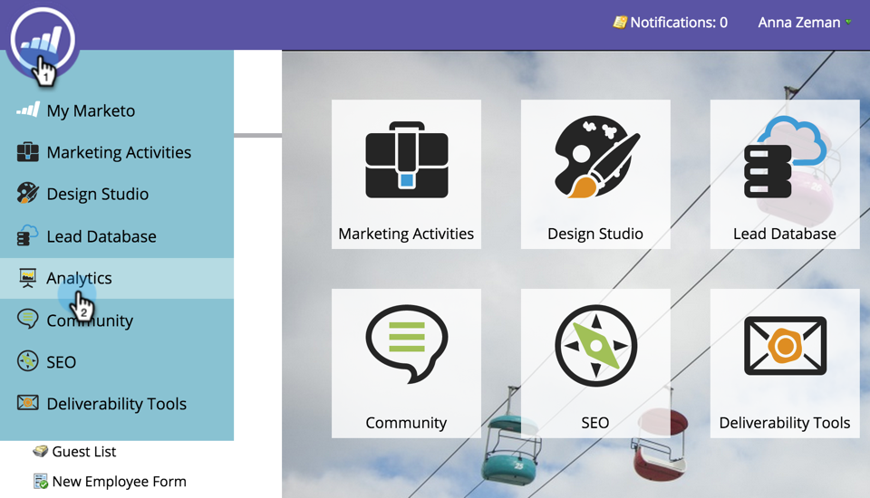
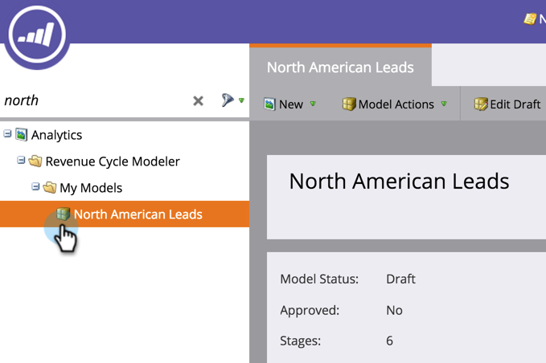
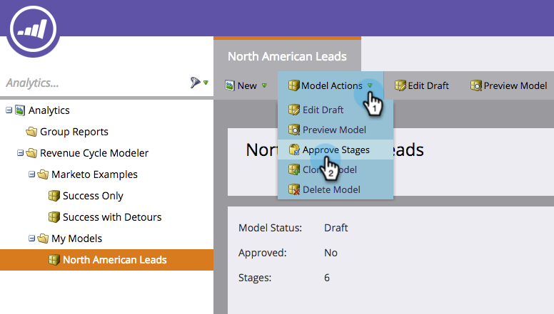

# Definir conversiones de Google AdWords en el modelo de ingresos {#set-google-adwords-conversions-in-the-revenue-model}

Vincule su cuenta de Google AdWords a Marketo para cargar automáticamente los datos de conversión sin conexión de Marketo a Google AdWords. A continuación, desde la interfaz de usuario de AdWords, podrá ver fácilmente qué clics tuvieron como resultado posibles clientes calificados, oportunidades y nuevos clientes (o las etapas de ingresos que desee rastrear) después de [agregar columnas personalizadas](https://support.google.com/adwords/answer/3073556) en AdWords.

>[!NOTE]
>
>Se trata de una integración push de Marketo a Google AdWords. Aparecerán los datos de conversión _only_ en su portal de Google AdWords, _no en la interfaz de usuario de Marketo_.

Más información sobre [Función de importación de conversión sin conexión de Google](https://support.google.com/adwords/answer/2998031?hl=en). Asigne conversiones sin conexión de AdWords a una o más etapas de un modelo de ingresos. Existen tres formas de realizar la asignación:

* Conversión de AdWords
* Acción de fase
* Asignación de AdWords

Puede crear una nueva conversión sin conexión de AdWords desde Marketo si utiliza Acción de ensayo.

>[!PREREQUISITES]
>
>[Añadir Google AdWords como un servicio de LaunchPoint](/help/marketo/product-docs/administration/additional-integrations/add-google-adwords-as-a-launchpoint-service.md)

## Uso de la conversión de AdWords {#use-adwords-conversion}

1. Vaya a la **Analytics** .

   

1. Seleccione un modelo.

   

1. Haga clic en **Editar borrador**.

   

1. Seleccione la etapa de ingresos que desea asignar a una conversión de AdWords.

   

1. Seleccione el **Conversión de AdWords** le gustaría asignar a su etapa de Marketo.

   

   ¡Muy bien! Los datos de conversión de AdWords se cargarán en Google AdWords en la cadencia seleccionada.

## Usar acción de etapa {#use-stage-action}

También puede asignar una conversión de AdWords en Acciones de etapa.

1. Seleccione el paso que desee asignar a una conversión de AdWords.

   

1. En el **Acciones de fase** desplegable, seleccione **Establecer conversión de AdWords**.

   

1. Seleccione un **Conversión de AdWords**.

   

   **Sugerencia**: Si no tiene conversiones de AdWords, cree una haciendo clic en **+Nueva conversión**.

   

1. Haga clic en **Guardar**.

   

1. Cuando haya terminado de asignar todas las conversiones de AdWords a etapas de ingresos, vuelva a la página de resumen. Select **Acciones de modelo** y elija **Aprobar etapas**.

   

## Consejo de Pro: Agregar una nueva conversión {#pro-tip-add-a-new-conversion}

Consejo a favor! Se puede crear una nueva conversión sin conexión de AdWords desde Marketo.

>[!CAUTION]
>
>Las nuevas conversiones creadas a partir de Marketo tienen habilitada la configuración de &quot;optimización&quot;. Esto significa que las estrategias de oferta de AdWords están permitidas para optimizar las ofertas para esas conversiones. Puede cambiar esta configuración desde la cuenta de AdWords.

1. En el **Acciones de fase** desplegable, seleccione **Establecer conversión de AdWords**.

   

1. Select **Nueva conversión**.

   

1. Escriba un **Nombre de conversión**. Haga clic en **Guardar**.

   

   ¡Excelente! Esta nueva conversión aparecerá en su cuenta de AdWords.

## Usar la asignación de AdWords {#use-adwords-mapping}

Puede asociar todas las etapas del modelo con la conversión de AdWords en un solo lugar mediante asignaciones de AdWords.

1. Select **Editar asignaciones de AdWords**.

   

1. Seleccione el **Conversión de AdWords** para cada etapa que desee rastrear.

   

1. Una vez asignadas las etapas, haga clic en **Guardar**.

   

1. Cuando haya terminado de asignar todas las conversiones de AdWords a etapas de ingresos, vuelva a la página de resumen. Select **Acciones de modelo** y elija **Aprobar etapas**.

   

Para ver los datos de conversión sin conexión, deberá iniciar sesión en su cuenta de AdWords. Le recomendamos que use su [Función Columnas personalizadas](https://support.google.com/adwords/answer/3073556) para crear columnas de recuento de conversiones para cada conversión sin conexión que importe desde Marketo.
