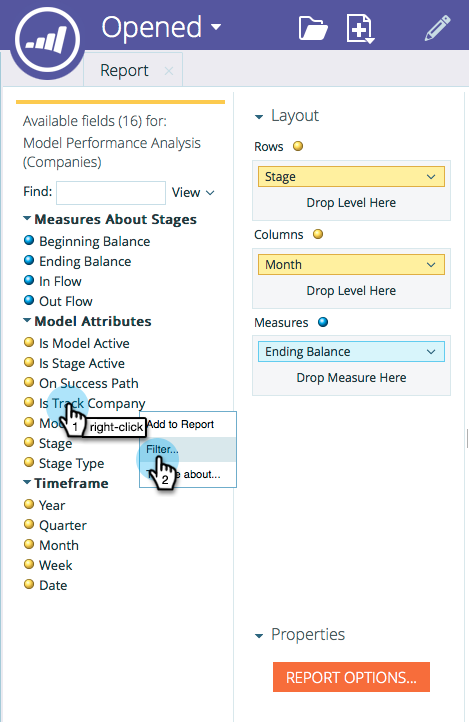

# Iniciar el seguimiento por la cuenta en el modelador de ingresos {#start-tracking-by-account-in-the-revenue-modeler}

Con la Modeler de la etapa de ingresos y [!UICONTROL Explorador de ingresos], obtendrá insight en el rendimiento de sus clientes potenciales y cuentas a medida que progresan en su modelo.

>[!NOTE]
>
>Asegúrese de que el modelo aprobado tenga etapas en la ruta de éxito con **Iniciar seguimiento por cuenta** verificado

1. Una vez transcurrido el tiempo suficiente para recopilar datos útiles, seleccione **[!UICONTROL Explorador de ingresos]** en **Mi página de inicio de Marketo**.

   

1. Para crear un nuevo informe, haz clic en **[!UICONTROL Archivo]** y selecciona **[!UICONTROL Nuevo]** y luego **[!UICONTROL Informe]**.

   

1. Seleccione **[!UICONTROL Análisis de rendimiento del modelo (Compañías)]** como área de análisis y haga clic en **[!UICONTROL Aceptar]**.

   

1. Le recomendamos que arrastre los campos **[!UICONTROL Etapa]**, **[!UICONTROL Mes]** y **[!UICONTROL Saldo final]** para mostrar la progresión mensual de las compañías a través de su modelo. Utilice los filtros para seleccionar los meses que desee.

   

1. Cuando termine de configurar el informe, haga clic con el botón derecho en **[!UICONTROL Is Track Company]** y seleccione **[!UICONTROL Filter]**. Usaremos esto para limitar el informe a solamente etapas donde se ha seleccionado **Seguimiento por cuenta**.

   

1. En el cuadro de diálogo que aparece, seleccione **[!UICONTROL Yes]** y haga clic en la flecha que señala a la derecha en el centro. Esto filtrará solo las etapas con &quot;Seguimiento por cuenta&quot; habilitado. Haga clic en **[!UICONTROL Aceptar]** cuando haya terminado.

   

1. El informe ahora debería mostrar solo las etapas que está rastreando por cuenta. Asegúrese de guardar el informe para poder utilizarlo en el futuro. Ahora puede utilizarlo como otra medida del éxito de sus esfuerzos de marketing.
