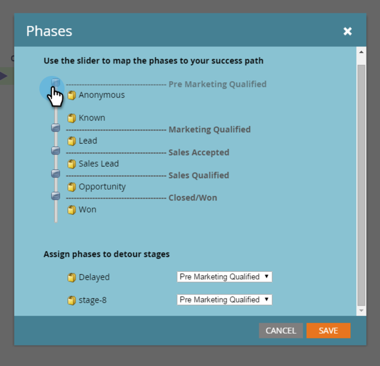

# Explicación de las fases del modelo de ingresos {#understanding-revenue-model-phases}

Las fases son una forma de agrupar una serie de etapas. A veces, varias fases de un modelo reflejan una fase de una funnel.

## Definir las fases del modelo {#define-the-phases-of-the-model}

1. Haga clic en **[!UICONTROL Fases]**.

   

1. Haga clic en el botón azul para arrastrar las fases hacia arriba y hacia abajo a través de las fases.

   
