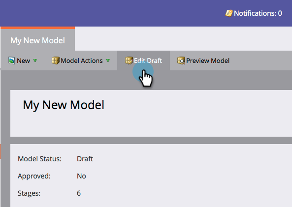

# Uso de las etapas de puerta del modelo de ingresos {#using-revenue-model-gate-stages}

Un escenario de puerta sirve como verificación de cualificación.

>[!TIP]
>
>Es una buena idea crear un modelo de práctica en un programa de gráficos o presentaciones y confirmarlo con sus colegas.

## Añadir Una Fase De Puerta {#add-a-gate-stage}

1. Vaya al área **Analytics**.

   

1. Seleccione un modelo existente o [cree uno nuevo](/help/marketo/product-docs/reporting/revenue-cycle-analytics/revenue-cycle-models/create-a-new-revenue-model.md).

   

1. Haga clic en **Editar borrador**.

   

1. Haga clic en el botón **Puerta**, luego arrastre y suelte en cualquier parte del lienzo.

   

1. Edite el **Nombre** y seleccione un **Tipo**.

   >[!NOTE]
   >
   >Seleccione [Seguimiento de Inicios por cuenta](/help/marketo/product-docs/reporting/revenue-cycle-analytics/revenue-cycle-models/start-tracking-by-account-in-the-revenue-modeler.md) en este momento para obtener información sobre el rendimiento de las cuentas a medida que avanzan a través del modelo.

   

>[!NOTE]
>
>La etapa Puerta divide los leads según los criterios introducidos en las reglas de transición; **no contiene leads**. Se requiere una transición predeterminada para que los leads que no son elegidos por las otras transiciones terminen pasando por el valor predeterminado.

## Editar una etapa de puerta {#edit-a-gate-stage}

Edite el Nombre, la Descripción y ajuste el Tipo de la etapa de la Puerta. También puede optar por [Seguimiento de Inicios por cuenta](/help/marketo/product-docs/reporting/revenue-cycle-analytics/revenue-cycle-models/start-tracking-by-account-in-the-revenue-modeler.md).

1. Haga clic en un icono de escenario **Puerta**.

   

1. Haga clic en los campos **Nombre** y **Descripción** para editar su contenido.

   

1. Seleccione la lista desplegable **Tipo** para editar.

   

## Eliminar una etapa de portal {#delete-a-gate-stage}

1. Puede eliminar una etapa de puerta haciendo clic con el botón derecho en el icono de etapa de Puerta y seleccionando **Eliminar**.

   

1. También puede eliminar una etapa de Puerta haciendo clic en ella y luego en la lista desplegable **Acciones de la etapa**, seleccionando **Eliminar**.

   

1. Ambos métodos de eliminación le piden que confirme su elección. Haga clic en **Eliminar**.

   

¡Felicidades! Ahora entienden el maravilloso mundo de las etapas de la puerta.

>[!MORELIKETHIS]
>
>* [Uso de las fases de inventario del modelo de ingresos](/help/marketo/product-docs/reporting/revenue-cycle-analytics/revenue-cycle-models/using-revenue-model-inventory-stages.md)
>* [Uso de las fases SLA del modelo de ingresos](/help/marketo/product-docs/reporting/revenue-cycle-analytics/revenue-cycle-models/using-revenue-model-sla-stages.md)
>* [Crear un nuevo modelo](/help/marketo/product-docs/reporting/revenue-cycle-analytics/revenue-cycle-models/create-a-new-revenue-model.md) de ingresos.

