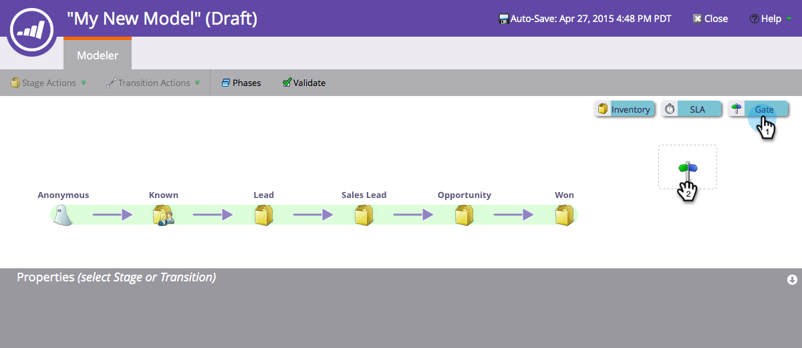
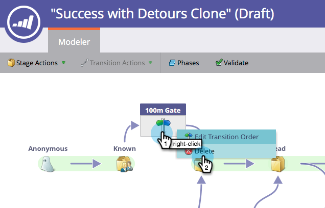

# Uso de etapas de puerta del modelo de ingresos {#using-revenue-model-gate-stages}

Una etapa de puerta sirve como una comprobación de calificación.

>[!TIP]
>
>Es una idea buena crear un modelo de práctica en un programa de gráficos o presentación y confirmarlo con sus colegas.

## Agregar Una Fase De Puerta {#add-a-gate-stage}

1. Vaya a la **Analytics** área.

   

1. Seleccione un modelo existente o [crear uno nuevo](/help/marketo/product-docs/reporting/revenue-cycle-analytics/revenue-cycle-models/create-a-new-revenue-model.md).

   

1. Clic **Editar borrador**.

   

1. Haga clic en **Puerta** y, a continuación, arrastre y suelte en cualquier lugar del lienzo.

   

1. Edite el **Nombre** y seleccione una **Tipo**.

   >[!NOTE]
   >
   >Seleccionar [Iniciar el seguimiento por cuenta](/help/marketo/product-docs/reporting/revenue-cycle-analytics/revenue-cycle-models/start-tracking-by-account-in-the-revenue-modeler.md) en este momento para obtener información sobre el rendimiento de sus cuentas a medida que progresan en el modelo.

   

>[!NOTE]
>
>La fase de puerta divide los posibles clientes en función de los criterios introducidos en las reglas de transición; **no contiene posibles clientes**. Se requiere una transición predeterminada para que los posibles clientes que no son elegidos por las otras transiciones terminen pasando por la transición predeterminada.

## Editar una fase de puerta {#edit-a-gate-stage}

Edite el Nombre, la Descripción y ajuste el Tipo de fase de la Puerta. También puede optar por [Iniciar el seguimiento por cuenta](/help/marketo/product-docs/reporting/revenue-cycle-analytics/revenue-cycle-models/start-tracking-by-account-in-the-revenue-modeler.md).

1. Haga clic en **Puerta** icono del escenario.

   

1. Haga clic dentro de **Nombre** y **Descripción** para editar su contenido.

   

1. Seleccione el **Tipo** desplegable para editar.

   

## Eliminar Una Fase De Puerta {#delete-a-gate-stage}

1. Para eliminar una fase de puerta, haga clic con el botón derecho en el icono de fase de puerta y seleccione **Eliminar**.

   

1. También puede eliminar una fase de Puerta haciendo clic en ella y, a continuación, en **Acciones de fase** lista desplegable, seleccionar **Eliminar**.

   

1. Ambos métodos de eliminación le piden que confirme su elección. Clic **Eliminar**.

   

¡Felicidades! Ahora entiendes el maravilloso mundo de Gate Stages.

>[!MORELIKETHIS]
>
>* [Uso de Etapas de Inventario del Modelo de Ingresos](/help/marketo/product-docs/reporting/revenue-cycle-analytics/revenue-cycle-models/using-revenue-model-inventory-stages.md)
>* [Uso de etapas SLA del modelo de ingresos](/help/marketo/product-docs/reporting/revenue-cycle-analytics/revenue-cycle-models/using-revenue-model-sla-stages.md)
>* [Crear un nuevo modelo de ingresos](/help/marketo/product-docs/reporting/revenue-cycle-analytics/revenue-cycle-models/create-a-new-revenue-model.md).
