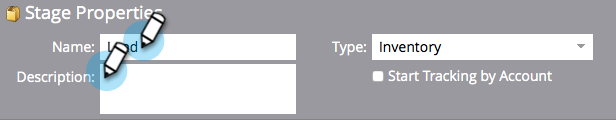

# Uso de las fases de inventario del modelo de ingresos {#using-revenue-model-inventory-stages}

Todos los leads y cuentas conocidos residen inicialmente en la etapa de inventario. Este grupo de clientes potenciales es donde se alimentan los posibles clientes hasta que estén listos para las ventas. No hay límite de tiempo en una etapa de inventario.

>[!TIP]
>
>Es una idea buena crear un modelo de práctica en un programa de gráficos o presentaciones y confirmarlo primero con sus colegas.

## Añadir Una Etapa De Inventario {#add-an-inventory-stage}

1. Para agregar una nueva etapa de inventario del modelo de ciclo de ingresos, haga clic en el botón **Análisis** en la pantalla de inicio **Mi marketing**.

   

1. En la sección **Analytics**, seleccione el modelo existente o [cree uno nuevo](/help/marketo/product-docs/reporting/revenue-cycle-analytics/revenue-cycle-models/create-a-new-revenue-model.md).

   

1. Haga clic en **Editar borrador**.

   

1. Para agregar una nueva etapa de inventario, haga clic en el botón **Inventario** y luego arrastre y suelte en cualquier lugar dentro del lienzo.

   

1. Puede editar el nombre, agregar una descripción y ajustar el tipo después de agregar un escenario. También puede seleccionar **[Seguimiento de Inicios por cuenta](/help/marketo/product-docs/reporting/revenue-cycle-analytics/revenue-cycle-models/start-tracking-by-account-in-the-revenue-modeler.md)** en este momento.

   

## Editar una etapa de inventario {#edit-an-inventory-stage}

Al seleccionar un icono de inventario, puede editar el **Nombre**, agregar una **Descripción** o ajustar el **Tipo**. También puede seleccionar [Seguimiento de Inicios por cuenta](/help/marketo/product-docs/reporting/revenue-cycle-analytics/revenue-cycle-models/start-tracking-by-account-in-the-revenue-modeler.md).

1. Haga clic en un icono de inventario.

   

1. Haga clic en los campos **Nombre** y **Descripción** para editar su contenido.

   

1. Seleccione el menú desplegable **Tipo** para editar.

   

## Eliminar Una Etapa De Inventario {#delete-an-inventory-stage}

1. Puede eliminar una etapa de inventario haciendo clic con el botón derecho o haciendo clic en un icono de etapa de inventario.

   

1. También puede eliminar una etapa haciendo clic en ella y, en la lista desplegable **Acciones de la etapa**, seleccione **Eliminar**.

   

1. Ambos métodos de eliminación le piden que confirme su elección. Haga clic en **Eliminar**.

   

¡Felicidades! Ahora entendemos el maravilloso mundo de las etapas del inventario.
