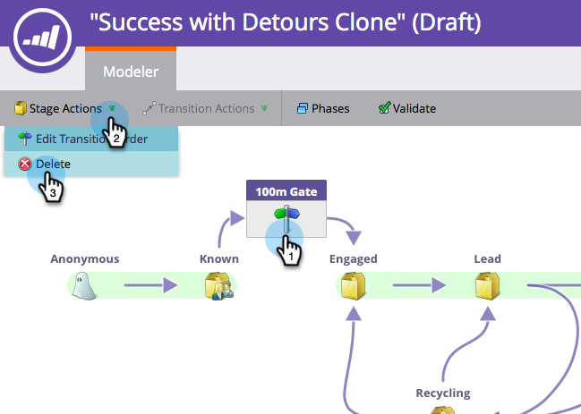

# Uso de Fases SLA del Modelo de Ingresos {#using-revenue-model-sla-stages}

SLA significa &quot;acuerdo de nivel de servicio&quot;. Estas etapas se utilizan cuando hay un tiempo máximo definido en el que un posible cliente debe ser evaluado o procesado antes de avanzar o salir del proceso.

>[!TIP]
>
>Es una buena idea crear un modelo de práctica en un programa de gráficos o presentaciones y confirmarlo con sus colegas.

## Agregar Una Etapa SLA {#add-an-sla-stage}

1. Para agregar una nueva etapa de SLA del modelo de ciclo de ingresos, haga clic en el botón **Analytics** en la pantalla de inicio de My Marketo.

   

1. En la sección Analytics , seleccione el modelo existente o [crear uno nuevo](/help/marketo/product-docs/reporting/revenue-cycle-analytics/revenue-cycle-models/create-a-new-revenue-model.md).

   

1. Haga clic en **Editar borrador**.

   

1. Para agregar una nueva etapa de SLA, haga clic en el botón **SLA** , luego arrastre y suelte en cualquier lugar dentro del lienzo.

   

1. Puede editar la variable **Nombre**, agregue un **Descripción** y ajuste el **Tipo** después de añadir un escenario. También puede seleccionar **[Iniciar el seguimiento por cuenta](/help/marketo/product-docs/reporting/revenue-cycle-analytics/revenue-cycle-models/start-tracking-by-account-in-the-revenue-modeler.md)** en este momento.

   

## Editar una etapa de SLA {#edit-an-sla-stage}

Cuando seleccione un icono de etapa de SLA, puede editar el Nombre, agregar una Descripción y ajustar el Tipo. También puede seleccionar [Iniciar el seguimiento por cuenta](/help/marketo/product-docs/reporting/revenue-cycle-analytics/revenue-cycle-models/start-tracking-by-account-in-the-revenue-modeler.md).

1. Haga clic en un icono de etapa de SLA.

   

1. Haga clic dentro de **Nombre** y **Descripción** para editar su contenido.

   

1. Seleccione el **Tipo** para editar.

   

## Eliminar Una Etapa SLA {#delete-an-sla-stage}

1. Puede eliminar una etapa de SLA haciendo clic con el botón derecho o haciendo clic con el botón control del ratón en un icono de etapa de SLA.

   

1. También puede eliminar una etapa haciendo clic en ella y, a continuación, en la lista desplegable Acciones de la fase, seleccione Eliminar.

   
