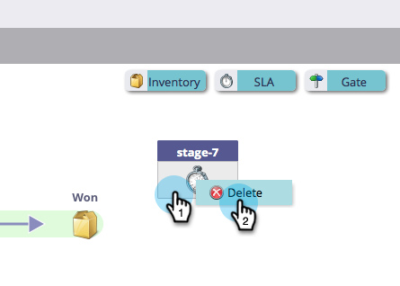

# Uso de etapas de SLA del modelo de ingresos {#using-revenue-model-sla-stages}

SLA significa &quot;service level agreement&quot;. Estas fases se utilizan cuando hay un tiempo máximo definido en el que se debe evaluar o procesar un posible cliente antes de avanzar o salir del proceso.

>[!TIP]
>
>Es una buena idea crear un modelo de práctica en un programa de gráficos o presentación y confirmarlo con sus colegas.

## Añadir Una Fase De SLA {#add-an-sla-stage}

1. Para agregar una nueva etapa de SLA del modelo del ciclo de ingresos, haga clic en el botón **[!UICONTROL Analytics]** en la pantalla de inicio de [!UICONTROL Mi Marketo].

   

1. En la sección [!UICONTROL Analytics], seleccione el modelo existente o [cree uno nuevo](/help/marketo/product-docs/reporting/revenue-cycle-analytics/revenue-cycle-models/create-a-new-revenue-model.md).

   

1. Haga clic en **[!UICONTROL Editar borrador]**.

   

1. Para agregar una nueva etapa de SLA, haz clic en el botón **[!UICONTROL SLA]**, luego arrastra y suelta en cualquier lugar dentro del lienzo.

   

1. Puede editar **[!UICONTROL Name]**, agregar **[!UICONTROL Description]** y ajustar **[!UICONTROL Type]** después de agregar una fase. También puede seleccionar **[[!UICONTROL Iniciar el seguimiento por cuenta]](/help/marketo/product-docs/reporting/revenue-cycle-analytics/revenue-cycle-models/start-tracking-by-account-in-the-revenue-modeler.md)** en este momento.

   

## Editar una fase de SLA {#edit-an-sla-stage}

Al seleccionar un icono de fase de SLA, puede editar **[!UICONTROL Nombre]**, agregar una **[!UICONTROL Descripción]** y ajustar el **[!UICONTROL Tipo]**. También puede seleccionar [[!UICONTROL Iniciar el seguimiento por cuenta]](/help/marketo/product-docs/reporting/revenue-cycle-analytics/revenue-cycle-models/start-tracking-by-account-in-the-revenue-modeler.md).

1. Haga clic en un icono de fase de SLA.

   

1. Haga clic dentro de los campos **[!UICONTROL Nombre]** y **[!UICONTROL Descripción]** para editar su contenido.

   

1. Seleccione la lista desplegable **[!UICONTROL Tipo]** que desea editar.

   

## Eliminar Una Fase De SLA {#delete-an-sla-stage}

1. Puede eliminar una fase de SLA haciendo clic con el botón derecho o manteniendo pulsado el botón de control y haciendo clic en un icono de fase de SLA.

   

1. También puede eliminar una fase haciendo clic en ella y luego, en la lista desplegable **[!UICONTROL Acciones de fase]**, seleccione **[!UICONTROL Eliminar]**.

   
