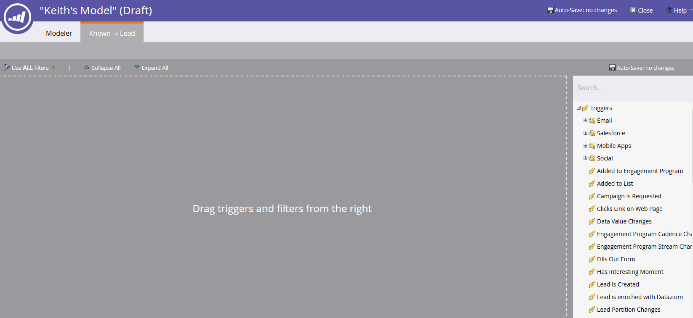

# Uso de Transiciones del modelo de ingresos {#using-revenue-model-transitions}

>[!PREREQUISITES]
>
>[Crear un nuevo modelo de ingresos](/help/marketo/product-docs/reporting/revenue-cycle-analytics/revenue-cycle-models/create-a-new-revenue-model.md)

Al crear el modelo y seleccionar y organizar las etapas del inventario, es hora de establecer las transiciones.

1. Haga clic con el botón derecho (también puede hacer clic con el doble) en una de las flechas para comenzar y seleccione **Editar Transición**.

   

   >[!NOTE]
   >
   >Las reglas de transición &#39;Anonymous  Known&#39; no se pueden editar.

1. Se abrirá una nueva ficha para la transición seleccionada.

   

1. Las transiciones controlan cómo se mueven los leads entre etapas. Arrastre el déclencheur (o el filtro) de su elección desde la derecha y suelte en cualquier lugar en el lienzo. En este ejemplo, seleccionaremos el déclencheur Rellenar formulario.

   >[!TIP]
   >
   >Dado que el modelador de ingresos está configurando para sistemas de informes, se recomienda que las transiciones siempre incluyan déclencheur. De este modo, los informes reflejarán la verdadera velocidad del flujo de etapas/modelos. Se pueden agregar filtros con los déclencheur para restricciones adicionales.

   

1. Elija los parámetros del déclencheur o filtro seleccionado.

   

1. Para volver al modelo, haga clic en **Modelador**.

   

1. En la parte inferior de la pantalla verá las reglas de transición.

   

1. Una vez que haya configurado las reglas para todas sus transiciones, haga clic en **Validar** para verificarlas.

   

1. Si lo hace correctamente, verá el siguiente mensaje.

   

¡Bien hecho! Ha modificado correctamente sus transiciones de modelo.

>[!MORELIKETHIS]
>
>[Aprobar o desaprobar un modelo de ingresos](/help/marketo/product-docs/reporting/revenue-cycle-analytics/revenue-cycle-models/approve-unapprove-a-revenue-model.md)
