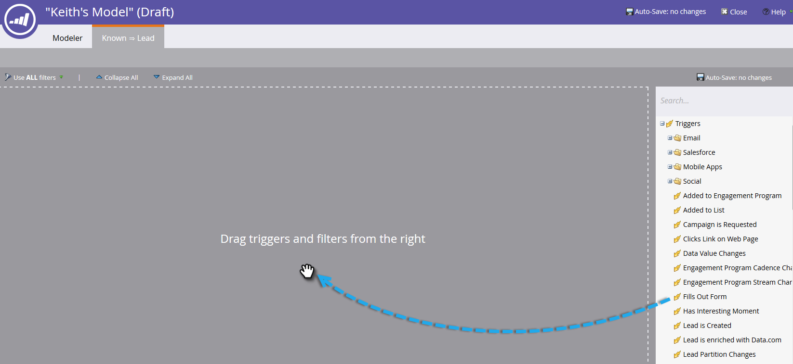

# Uso de transiciones del modelo de ingresos {#using-revenue-model-transitions}

>[!PREREQUISITES]
>
>[Crear un nuevo modelo de ingresos](/help/marketo/product-docs/reporting/revenue-cycle-analytics/revenue-cycle-models/create-a-new-revenue-model.md)

Cuando crea el modelo y selecciona y organiza las etapas del inventario, es hora de establecer las transiciones.

1. Haga clic con el botón derecho (también puede hacer doble clic) en una de las flechas para comenzar y seleccione **[!UICONTROL Editar transición]**.

   

   >[!NOTE]
   >
   >No se pueden editar las reglas de transición &#39;[!UICONTROL Anonymous] ⇒ [!UICONTROL Known]&#39;.

1. Se abrirá una nueva pestaña para la transición seleccionada.

   

1. Las transiciones controlan cómo se mueven los posibles clientes entre etapas. Arrastre el déclencheur (o filtro) que desee desde la derecha y suéltelo en cualquier lugar del lienzo. En este ejemplo, seleccionaremos el déclencheur **[!UICONTROL Rellena formulario]**.

   >[!TIP]
   >
   >Dado que el modelador de ingresos le está configurando para la creación de informes, se recomienda que las transiciones siempre incluyan déclencheur. De este modo, los informes reflejarán la velocidad real del flujo de modelo/fase. Se pueden añadir filtros con los déclencheur para restricciones adicionales.

   

1. Elija los parámetros del déclencheur o filtro seleccionado.

   

1. Para volver al modelo, haz clic en **[!UICONTROL Modeler]**.

   

1. En la parte inferior de la pantalla, ahora verá las reglas de transición.

   

1. Una vez que haya configurado las reglas para todas las transiciones, haga clic en **[!UICONTROL Validar]** para verificarlas.

   

1. Si se realiza correctamente, verá el siguiente mensaje.

   

¡Bien hecho! Ha modificado correctamente las transiciones del modelo.

>[!MORELIKETHIS]
>
>[Aprobar o desaprobar un modelo de ingresos](/help/marketo/product-docs/reporting/revenue-cycle-analytics/revenue-cycle-models/approve-unapprove-a-revenue-model.md)
