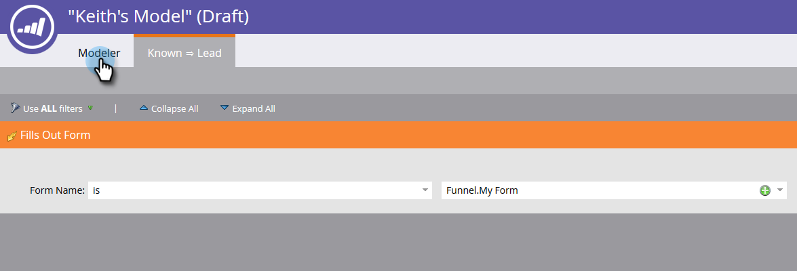

# Uso de transiciones del modelo de ingresos {#using-revenue-model-transitions}

>[!PREREQUISITES]
>
>[Crear un nuevo modelo de ingresos](/help/marketo/product-docs/reporting/revenue-cycle-analytics/revenue-cycle-models/create-a-new-revenue-model.md)

Al crear el modelo y seleccionar y organizar las etapas de inventario, es hora de establecer las transiciones.

1. Haga clic con el botón derecho (también puede hacer doble clic) en una de las flechas para comenzar y seleccione **Editar transición**.

   

   >[!NOTE]
   >
   >Las reglas de transición &#39;Anonymous SWIFTNet Known&#39; no se pueden editar.

1. Se abrirá una nueva pestaña para la transición seleccionada.

   

1. Las transiciones controlan cómo se mueven los posibles clientes entre etapas. Arrastre el déclencheur (o filtro) de su elección desde la derecha y libere en cualquier lugar del lienzo. En este ejemplo, seleccione el déclencheur Rellenar formulario .

   >[!TIP]
   >
   >Como el modelador de ingresos está configurando para los informes, se recomienda que las transiciones siempre incluyan déclencheur. De este modo, los informes reflejarán la velocidad real del flujo del modelo/escenario. Los filtros se pueden agregar con los déclencheur para obtener restricciones adicionales.

   

1. Elija los parámetros del déclencheur o filtro seleccionado.

   

1. Para volver al modelo, haga clic en **Modelador**.

   

1. En la parte inferior de la pantalla, ahora verá las reglas de transición.

   

1. Una vez que haya configurado las reglas para todas las transiciones, haga clic en **Validar** para verificar.

   

1. Si se realiza correctamente, verá el siguiente mensaje.

   

¡Bien hecho! Ha modificado correctamente las transiciones del modelo.

>[!MORELIKETHIS]
>
>[Aprobar/desaprobar un modelo de ingresos](/help/marketo/product-docs/reporting/revenue-cycle-analytics/revenue-cycle-models/approve-unapprove-a-revenue-model.md)
