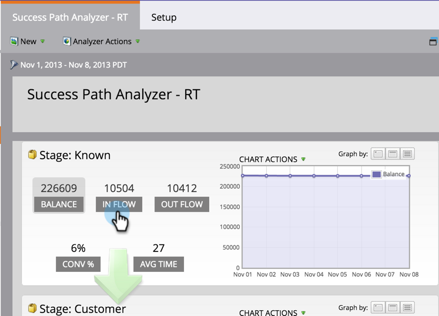
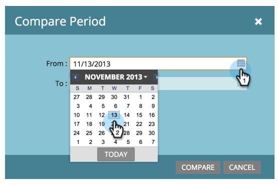
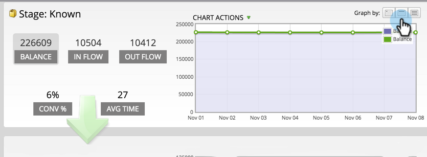
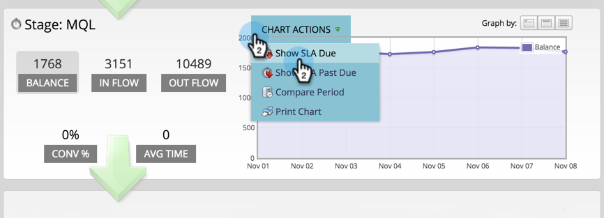
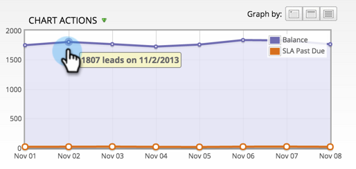

# Uso del analizador de rutas de éxito {#using-the-success-path-analyzer}

Utilice un analizador de rutas de éxito para explorar los detalles específicos que reflejan tanto el flujo (cantidad) como la velocidad (velocidad, en términos de días) de las personas a través de las etapas del [Modelo de ciclo de ingresos](/help/marketo/product-docs/reporting/revenue-cycle-analytics/revenue-cycle-models/understanding-revenue-models.md).

>[!PREREQUISITES]
>
>[Crear un analizador de rutas de éxito](/help/marketo/product-docs/reporting/revenue-cycle-analytics/revenue-cycle-models/create-a-success-path-analyzer.md)

1. Vaya a **Analytics** y seleccione **Analizador de rutas de éxito**.

   

   El gráfico de la derecha refleja los datos del botón seleccionado de la izquierda. De forma predeterminada, se trata de Balance.

1. Haga clic en **En flujo** para crear un gráfico de cuántas personas entraron al escenario durante el lapso de tiempo seleccionado.

   

   * Haga clic en Flujo para graficar cuántas personas salieron del escenario.
   * Haga clic en Conv % para graficar la tasa de conversión de esta a la siguiente etapa.
   * Haga clic en Promedio de tiempo para ver cuánto tiempo han pasado las personas en esta etapa antes de pasar al siguiente paso.

1. Haga clic en **Acciones de gráfico** > Comparar periodo para comparar los datos con un intervalo de tiempo diferente de igual longitud.

   

1. Seleccione el **De** fecha para el periodo de comparación.

   

   La variable **Hasta** se configura automáticamente para que coincida con la duración del período de tiempo original.

1. Haga clic en **Comparar**.

   

1. El gráfico se actualiza con datos superpuestos para el período de comparación, en verde.

   

1. Para cambiar la escala de tiempo del gráfico, haga clic en una de las **Gráfico por** botones: diariamente (predeterminado), semanalmente y mensualmente

   

1. Para etapas con SLAs (Acuerdos de Nivel de Servicio), haga clic en **Acciones de gráfico** > **Mostrar SLA vencido** para mostrar a todas las personas que alguna vez omitieron un objetivo de SLA dentro del lapso de tiempo especificado.

   

1. El gráfico se actualiza para reflejar cuántos SLAs se adeudaban en cada nodo, en naranja.

   

   La gente mostrada en naranja podría *o puede no* siga estando en la fase SLA.

1. Haga clic en **Acciones de gráfico** > **Mostrar SLA vencido** para mostrar todas las personas con objetivos SLA caducados que aún se encuentren en la fase SLA al final del período de tiempo especificado.

   

1. El gráfico se actualiza para reflejar cuántos SLAs se vencieron en cada nodo, en naranja.

   

1. Para leer los detalles específicos de un punto de datos en un nodo específico (fecha), pase el ratón sobre la burbuja.

   

1. Para imprimir el gráfico, haga clic en **Acciones de gráfico** > **Imprimir gráfico**.

   

El analizador está aquí para ayudarle a comprender el movimiento a través de su modelo. A medida que avance, esto será muy importante para diseñar estrategias de marketing.
