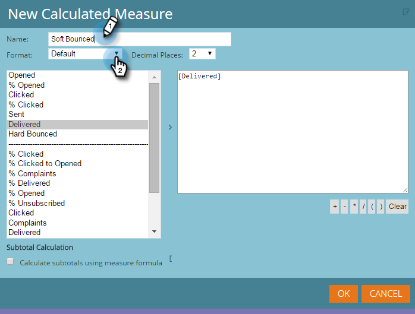

# Adición de medidas personalizadas a un informe del Explorador de ingresos {#adding-custom-measures-to-a-revenue-explorer-report}

A veces, desea una medida personalizada en un informe. Es fácil crear uno propio.

En el ejemplo siguiente, se crea una medida calculada para devoluciones leves, que toma métricas que ya están en el informe y utiliza matemáticas básicas para crear una nueva métrica. También puede crear otros tipos de medidas.

>[!PREREQUISITES]
>
>Necesita al menos una métrica en el informe, pero no tiene por qué ser una de las medidas que usa para definir la medida personalizada.

1. Desplácese por los campos que necesite para el informe. Consulte [Adición de campos a un informe del Explorador de ingresos](/help/marketo/product-docs/reporting/revenue-cycle-analytics/revenue-explorer/adding-fields-to-a-revenue-explorer-report.md) para obtener más información.

1. Haga clic con el botón derecho en una métrica existente (celda azul) y haga clic en **Medida definida por el usuario** y seleccione **Medida calculada**.

   

1. Asigne un nombre a la medida personalizada y seleccione un formato.

   

1. Haga clic en cada elemento que necesite a la izquierda y haga clic en la flecha para moverlo. Agregue símbolos matemáticos según sea necesario.

   

   >[!TIP]
   >
   >Puede escribir los símbolos matemáticos por su cuenta o utilizar el cuadro de selección.

1. Cuando haya terminado, haga clic en **OK**.

   

   La nueva medida personalizada aparece como una nueva columna en el informe.

   

   >[!MORELIKETHIS]
   >
   >[Adición de campos a un informe del Explorador de ingresos](/help/marketo/product-docs/reporting/revenue-cycle-analytics/revenue-explorer/adding-fields-to-a-revenue-explorer-report.md)
