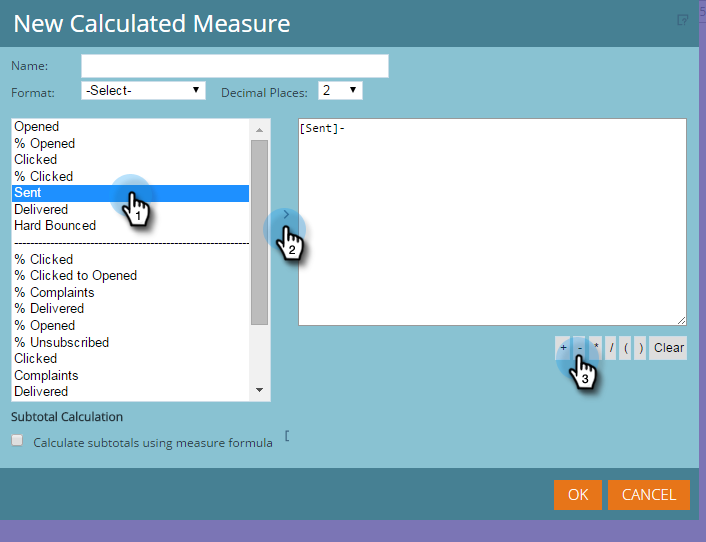

# Adición de medidas personalizadas a un informe del Explorador de ingresos {#adding-custom-measures-to-a-revenue-explorer-report}

En ocasiones, se desea incluir una medida personalizada en un informe. Es fácil crear los suyos propios.

En el ejemplo siguiente, se crea una medida calculada para los rechazos leves, que toma las métricas que ya están en el informe y utiliza matemáticas básicas para crear una nueva métrica. También puede crear otros tipos de medidas.

>[!PREREQUISITES]
>
>Se necesita al menos una métrica en el informe, pero no tiene por qué ser una de las medidas que se usen para definir la medida personalizada.

1. Coloque sobre los campos que necesita para su informe. Consulte [Adición de campos a un informe del Explorador de ingresos](/help/marketo/product-docs/reporting/revenue-cycle-analytics/revenue-explorer/adding-fields-to-a-revenue-explorer-report.md) para obtener más información.

1. Haga clic con el botón derecho en una métrica existente (celda azul), haga clic en **[!UICONTROL Medida definida por el usuario]** y seleccione **[!UICONTROL Medida calculada]**.

   

1. Asigne un nombre a la medida personalizada y seleccione un formato.

   

1. Haga clic en cada elemento que necesite a la izquierda y haga clic en la flecha para moverlo. Agregue símbolos matemáticos según sea necesario.

   

   >[!TIP]
   >
   >Puede escribir los símbolos matemáticos usted mismo o utilizar el cuadro de selección.

1. Cuando haya terminado, haga clic en **[!UICONTROL Aceptar]**.

   

   La nueva medida personalizada aparecerá como una nueva columna en el informe.

   

   >[!MORELIKETHIS]
   >
   >[Agregar campos a un informe de Explorador de ingresos](/help/marketo/product-docs/reporting/revenue-cycle-analytics/revenue-explorer/adding-fields-to-a-revenue-explorer-report.md)
