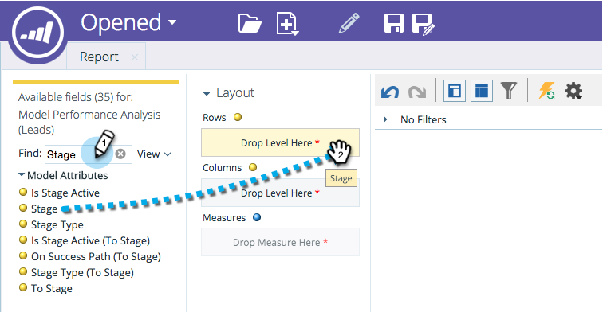

# Adición de campos a un informe de explorador de ingresos {#adding-fields-to-a-revenue-explorer-report}

Personalice los informes del explorador de ingresos arrastrando y soltando los campos de dimensión y métrica en el lienzo.

<table>
 <tbody>
  <tr>
   <th>Tipo de campo</th>
   <th>Descripción</th>
  </tr>
  <tr>
   <td>Campo amarillo o Dimension</td>
   <td>
Los campos amarillos son las dimensiones (filas y columnas) del informe.

Por ejemplo, puede configurar un informe que muestre el estado del posible cliente o la fecha de creación en columnas.
</td>
  </tr>
  <tr>
   <td>Campo o medida azul</td>
   <td>
Los campos azules son métricas que se analizan en los datos.

Por ejemplo: esta podría ser la puntuación de posible cliente promedio para sus posibles clientes o el número de días que un posible cliente tuvo una oportunidad.
</td>
  </tr>
 </tbody>
</table>

1. Busque los campos amarillos que desee utilizar y arrástrelos a Filas.

   

   >[!TIP]
   >
   >Pase el ratón sobre un campo para ver una descripción completa.

1. Busque los campos azules que desee utilizar y arrástrelos a Measures.

   

   ¡Fantástico! ¡Ahora tienes un informe completo!

   

>[!MORELIKETHIS]
>
>[Eliminación de un campo en un informe de Explorador de ingresos](/help/marketo/product-docs/reporting/revenue-cycle-analytics/revenue-explorer/deleting-a-field-in-a-revenue-explorer-report.md)
