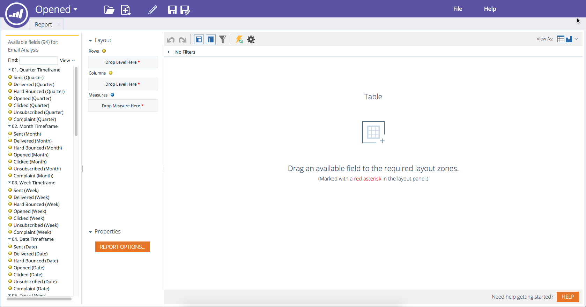

# Crear un informe del Explorador de ingresos {#create-a-revenue-explorer-report}

El informe Explorador de ingresos permite rastrear el ROI de las iniciativas de mercadotecnia.

>[!AVAILABILITY]
>
>No todos los clientes han adquirido esta funcionalidad. Póngase en contacto con su representante de ventas para obtener más detalles.

1. Vaya al área **Explorador de ingresos**.

   

1. Haga clic en **Crear nuevo** y luego seleccione **Informe**.

   

1. Elija un tipo de informe.

   

   ¡bueno! Ha creado oficialmente un informe. Tiempo de personalizar agregando algunos campos.

   

>[!MORELIKETHIS]
>
>[Añadir campos en un informe del Explorador de ingresos](/help/marketo/product-docs/reporting/revenue-cycle-analytics/revenue-explorer/adding-fields-to-a-revenue-explorer-report.md)
>[Añadir medidas personalizadas en un informe del Explorador de ingresos](/help/marketo/product-docs/reporting/revenue-cycle-analytics/revenue-explorer/adding-custom-measures-to-a-revenue-explorer-report.md)
