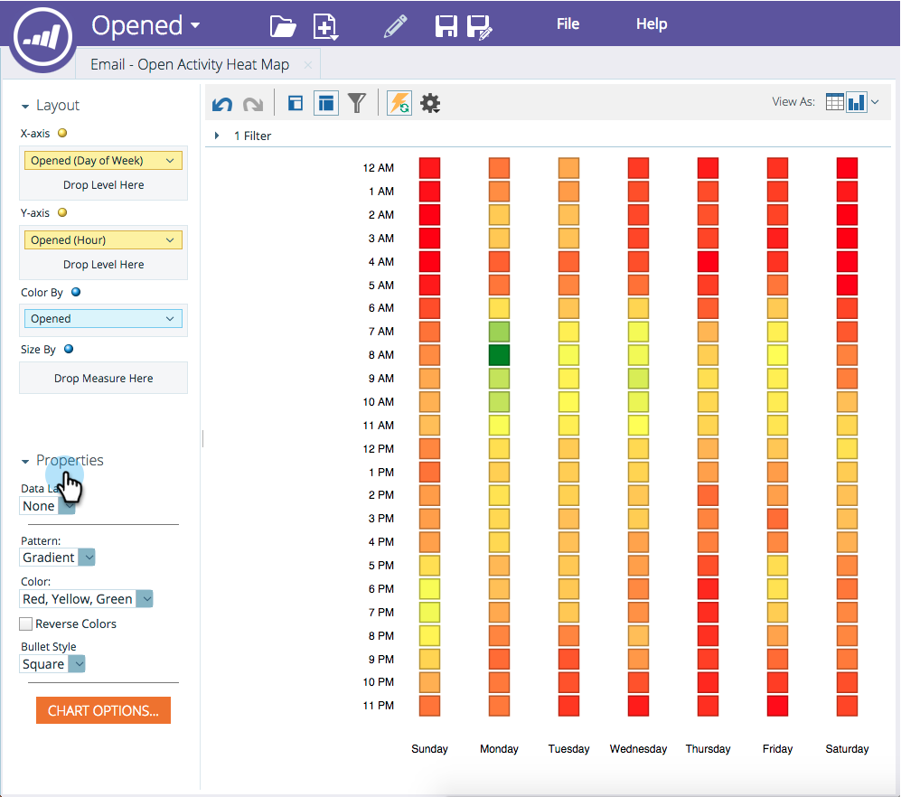

# Personalización y visualización de cuadrículas de calor {#customize-and-display-heat-grids}

Una cuadrícula de calor representa visualmente los datos en una cuadrícula de color para que pueda identificar patrones buenos y malos de forma más fácil y rápida.

1. En el informe, haga clic en el icono de gráfico y, a continuación, **[!UICONTROL Cuadrícula de calor]**.

   

1. Para hacer cambios en la **[!UICONTROL cuadrícula de calor]**, ve al área de **[!UICONTROL Propiedades]**.

   

   ¡Fantástico! ¡Ahora tienes tu **[!UICONTROL Cuadrícula de calor]**!
