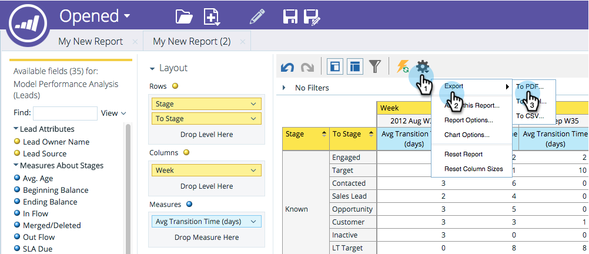

# Exportación de un informe del Explorador de ingresos {#exporting-a-revenue-explorer-report}

Puede exportar cualquier informe del explorador de ingresos y compartirlo con cualquier usuario.

1. Haga clic en el icono Engranaje, seleccione **Exportar** y seleccione un formato de archivo.

   

   >[!NOTE]
   >
   >Puede exportar un informe a los tres formatos siguientes:
   >
   >    
   >    
   >    * PDF
   >    * Excel
   >    * CSV

1. Seleccione el formato **y la** orientación **de la** página que desee y haga clic en **Exportar**.

   

   ¡Dulce! Envíe este archivo e impresione a sus compañeros con sus habilidades de mercadotecnia al estilo ninja.

>[!NOTE]
>
>**Artículos relacionados**
>
>* [Suscripción a un informe del Explorador de ingresos](subscribe-to-a-revenue-explorer-report.md)

>

