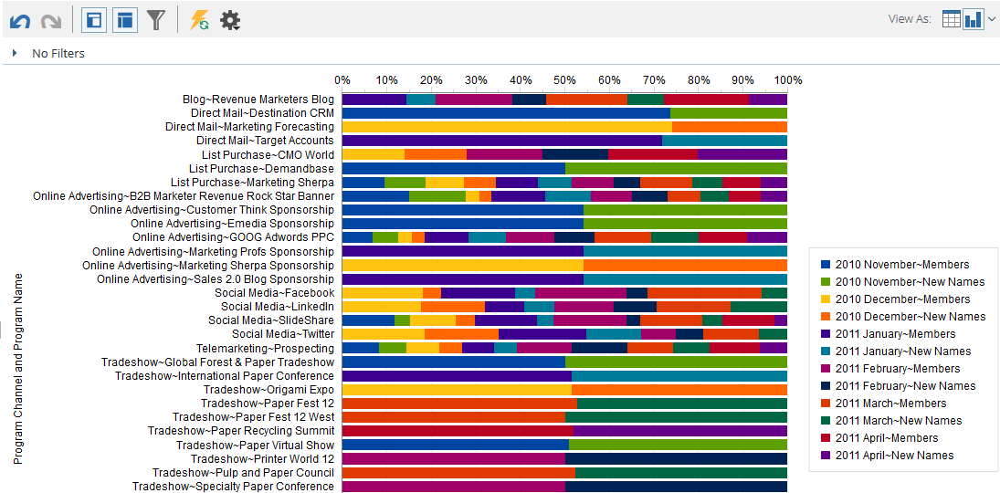

# Resultados De Gráficos Del Explorador De Ingresos {#graphing-results-from-revenue-explorer}

De forma predeterminada, los informes del Explorador de ingresos se muestran como una tabla. También tiene la opción de mostrar los resultados como un gráfico en varios formatos.

1. Haga clic en la flecha del menú desplegable **Ver como** del informe. Aparecerán diferentes opciones de gráficos.

   

## Ejemplos de gráficos {#graph-examples}

**Columna**: cada fila y columna de la tabla se muestra como una columna vertical.

**Columna apilada**: cada fila de la tabla tiene una columna en el gráfico.

**Columna apilada al 100%**: cada fila de la tabla tiene una columna en el gráfico y se escala al 100%.

**Línea**: cada columna se muestra como una línea y cada fila como un punto de datos en la línea.

**Combinación de columna y línea**: Combinación de gráficos de columna y línea.

**Barra**: Cada fila y columna de la tabla se muestra como una barra horizontal.

**Barra apilada**: Cada fila de la tabla tiene una fila en el gráfico.

**Barra apilada al 100 %**: Cada fila de la tabla tiene una fila en el gráfico y se escala al 100 %.

**Área**: los datos se muestran de forma similar a la barra apilada, pero se han rellenado.

**Circular**: cada columna se muestra como un gráfico circular, cada fila como una fracción.

**Sunburst**: Gráfico radial que representa atributos en sectores.

**Dispersión**: burbujas basadas en atributos utilizados. Utilice medidas para codificar con colores la burbuja y/o determinar su tamaño.

**Cuadrícula de calor**: personalice colores y formas para identificar patrones de rendimiento positivos y negativos.

1. Para volver a la vista de tabla, haga clic en el botón de tabla.

   
