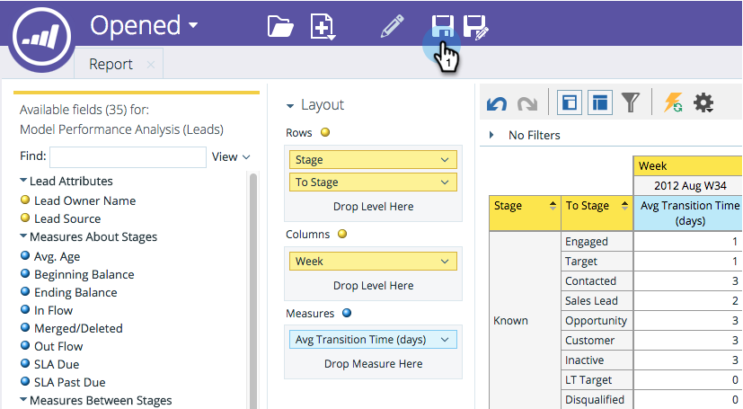

# Guardando un informe de [!UICONTROL Explorador de ingresos] {#saving-a-revenue-explorer-report}

Los informes de [!UICONTROL Revenue Explorer] se pueden guardar en el archivo que elija.

1. Haga clic en el icono Save.

   

   >[!NOTE]
   >
   >Los cambios que realice en el informe no se guardan automáticamente. Así que asegúrese de ahorrar a menudo!

1. Asigne un nombre descriptivo al informe, seleccione una ubicación y haga clic en **[!UICONTROL Guardar]**.

   

   ¡Eso es todo! Ahora puede obtener acceso a su archivo en **[!UICONTROL Examinar archivos]**.

   

>[!MORELIKETHIS]
>
>[Suscribirse a un informe de [!UICONTROL Explorador de ingresos]](/help/marketo/product-docs/reporting/revenue-cycle-analytics/revenue-explorer/subscribe-to-a-revenue-explorer-report.md)
