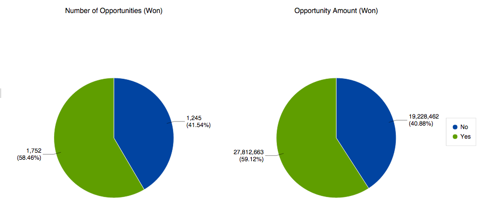

# Explicación del análisis de oportunidad en el explorador de ingresos {#understanding-opportunity-analysis-in-revenue-explorer}

El análisis de oportunidades en el Explorador de ingresos le permite examinar sus oportunidades a un nivel más profundo. Corte y fragmente los datos en función de cualquier atributo de cliente potencial/empresa, como la fuente, el sector o la ubicación geográfica del cliente potencial. Analice la creación y el cierre de oportunidades en función del nombre, la fase o la probabilidad. Descubra las contribuciones de marketing a la canalización.

## Análisis de ejemplo {#example-analysis}

Estos son algunos informes que puede crear en el área de Análisis de oportunidad.

1. Influencia del marketing en las oportunidades creadas

   ¿Qué porcentaje de la canalización de su empresa se vio influido por sus programas de marketing? Este informe le ofrece la respuesta. Los siguientes gráficos circulares muestran el porcentaje del número de todas las oportunidades y la cantidad de oportunidad que adquirió un programa de marketing.

   

1. Influencia del marketing en oportunidades cerradas y ganadas.

   Este informe muestra cuántos ingresos se han adquirido y qué influencia ha tenido el marketing, por número y cantidad.

   

1. Oportunidad cerrada por Source de posibles clientes

   Este informe desglosa todas las oportunidades cerradas por el origen del posible cliente y le ofrece una visión general clara de qué fuentes funcionan y cuáles no.

   

1. Tiempo para el cierre por Source

   Este informe muestra la relación entre el promedio de días para cerrar una oportunidad y el origen del posible cliente.

   

1. Abrir oportunidad y fase

   Este informe muestra cuántas oportunidades hay abiertas en cada fase del ciclo de ingresos.

   

1. Número de oportunidades por año y por sector

   Este informe responde a la pregunta: &quot;¿Estamos obteniendo más o menos oportunidades de ciertas industrias año tras año?&quot;

   

## Dimensiones y medidas del análisis de oportunidad {#opportunity-analysis-dimensions-and-measures}

El análisis de oportunidad le permite acceder a todas las dimensiones relacionadas con el posible cliente, la empresa y la oportunidad, así como a las medidas relacionadas con la oportunidad. Utilice estas dimensiones y medidas de análisis de oportunidades para responder preguntas específicas en el informe.

1. Atributos de la compañía

   | Dimensión | Descripción |
   |---|---|
   | Ingresos anuales | Ingresos anuales de la empresa |
   | Ciudad | La ciudad donde se encuentra la compañía |
   | País | El condado donde se encuentra la compañía |
   | Industria | El sector en el que se encuentra la compañía |
   | Nombre de la empresa | Nombre de la empresa |
   | Número de empleados | Número de empleados de la compañía |
   | Código postal | Código postal de la empresa |
   | Código SIC | Código SIC de la empresa |
   | Estado | El estado donde se encuentra la compañía |

1. Atributos de los leads

   | Dimensión | Descripción |
   |---|---|
   | Incluido en la lista de bloqueados | El posible cliente está incluido en la lista de bloqueados |
   | Convertido a oportunidad | El posible cliente se convierte en una oportunidad |
   | Correo electrónico no válido | Si el posible cliente tiene una dirección de correo electrónico válida |
   | Marketing suspendido | ¿El posible cliente está suspendido de los correos electrónicos de marketing? |
   | Correo electrónico | Dirección de correo electrónico del posible cliente |
   | Cargo | Puesto de responsable |
   | Nombre completo | Nombre completo del posible cliente |
   | Tipo de origen original | Tipo de origen original del posible cliente |
   | Registrar tipo de Source | Tipo de origen registrado del posible cliente |
   | Email del propietario del lead | Dirección de correo electrónico del propietario del posible cliente |
   | Cargo del propietario del lead | Puesto del propietario del posible cliente |
   | Nombre del propietario del posible cliente | Nombre del propietario del posible cliente |
   | Origen del lead | Origen del cliente potencial |
   | Estado del lead | Estado del posible cliente |

1. Plazo de creación de cliente potencial

   | Dimensión | Descripción |
   |---|---|
   | Año de creación del posible cliente | El año en el que se crea el posible cliente |
   | Trimestre de creación de posible cliente | El trimestre en el que se crea el posible cliente |
   | Mes de creación de cliente potencial | El mes en el que se crea el posible cliente |
   | Semana de creación de cliente potencial | La semana en la que se crea el posible cliente |
   | Fecha de creación de cliente potencial | La fecha en la que se crea el posible cliente |

1. Atributos de la oportunidad

   | Dimensión | Descripción |
   |---|---|
   | Oportunidad cerrada | ¿La oportunidad está cerrada? |
   | Categoría de pronóstico de la oportunidad | Categoría de previsión de oportunidad |
   | Nombre de la oportunidad | Nombre de oportunidad |
   | Etapa de la oportunidad | Fase de oportunidad |
   | Tipo de oportunidad | Tipo de oportunidad |
   | Oportunidad ganada | ¿Esta oportunidad está cerrada y ganada? |
   | Oportunidad influenciada por marketing | Este indicador indica si alguno de los posibles clientes/contactos fue adquirido o tuvo éxito en algún programa de marketing. Solo se tienen en cuenta los programas que tienen un coste de periodo definido. |

1. Periodo de tiempo cerrado de oportunidad

   | Dimensión | Descripción |
   |---|---|
   | Oportunidad cerrada el año | El año en que se cierra la oportunidad |
   | Trimestre cerrado de oportunidad | El trimestre en el que se cierra la oportunidad |
   | Mes de cierre de oportunidad | El mes en el que se cierra la oportunidad |
   | Oportunidad Cerrada Semana | La semana en que se cierra la oportunidad |
   | Fecha de cierre de oportunidad | La fecha en la que se cierra la oportunidad |

1. Periodo de tiempo creado de oportunidad

   | Dimensión | Descripción |
   |---|---|
   | Oportunidad creada el año | El año en que se crea la oportunidad |
   | Trimestre de creación de oportunidad | El trimestre en el que se crea la oportunidad |
   | Mes de creación de oportunidad | El mes en el que se crea la oportunidad |
   | Semana de creación de oportunidad | La semana en que se crea la oportunidad |
   | Fecha de creación de la oportunidad | La fecha en la que se crea la oportunidad |

1. Medidas

   | Medida | Descripción |
   |---|---|
   | Promedio de días para cerrar la oportunidad | Promedio de días para cerrar una oportunidad |
   | Promedio de días para cerrar la oportunidad (perdidos) | Promedio de días hasta la pérdida de una oportunidad |
   | Promedio de días para cerrar la oportunidad (won) | Cantidad promedio de días a una oportunidad ganada |
   | Número de todas las oportunidades | Número total de todas las oportunidades |
   | Número de oportunidades (cerradas) | Número total de oportunidades cerradas (ganadas o perdidas) |
   | Número de oportunidades (perdidas) | Número total de oportunidades que se pierden |
   | Número de oportunidades (abiertas) | Número total de oportunidades que aún están abiertas |
   | Cantidad de oportunidades (ganadas) | Número total de oportunidades ganadas |
   | Monto de la oportunidad | Importe total de la oportunidad. Si hay más de un posible cliente asociado a una oportunidad, la cantidad de asignación se basa en la puntuación del posible cliente. |
   | Importe de oportunidad (perdido) | Cantidad total de oportunidades perdidas. Si hay más de un posible cliente asociado a una oportunidad, la cantidad de asignación se basa en la puntuación del posible cliente. |
   | Importe de oportunidad (Abierto) | Importe total de las oportunidades abiertas. Si hay más de un posible cliente asociado a una oportunidad, la cantidad de asignación se basa en la puntuación del posible cliente. |
   | Importe de oportunidad (won) | Importe total de las oportunidades ganadas. Si hay más de un posible cliente asociado a una oportunidad, la cantidad de asignación se basa en la puntuación del posible cliente. |

>[!MORELIKETHIS]
>
>* [Crear un informe de explorador de ingresos](/help/marketo/product-docs/reporting/revenue-cycle-analytics/revenue-explorer/create-a-revenue-explorer-report.md)
>* [Agregar campos a un informe de Explorador de ingresos](/help/marketo/product-docs/reporting/revenue-cycle-analytics/revenue-explorer/adding-fields-to-a-revenue-explorer-report.md)
>* [Suscribirse a un informe de Explorador de ingresos](/help/marketo/product-docs/reporting/revenue-cycle-analytics/revenue-explorer/subscribe-to-a-revenue-explorer-report.md)
