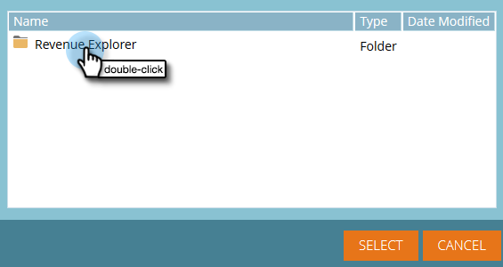
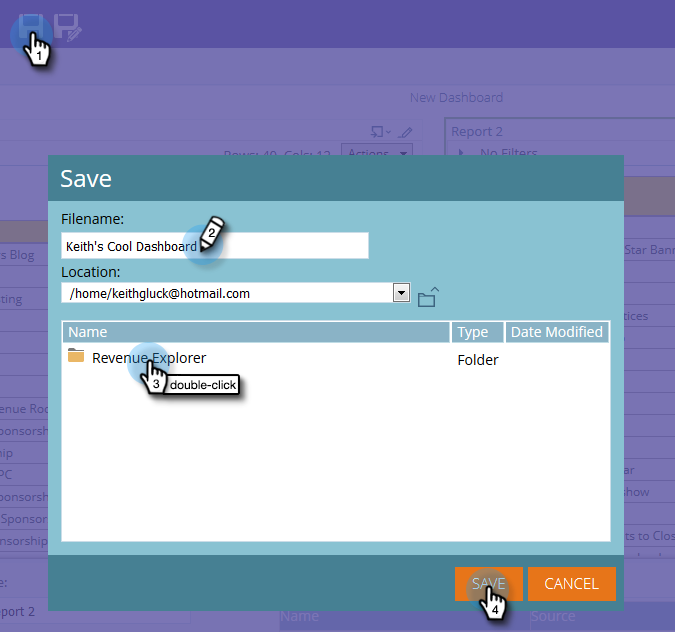
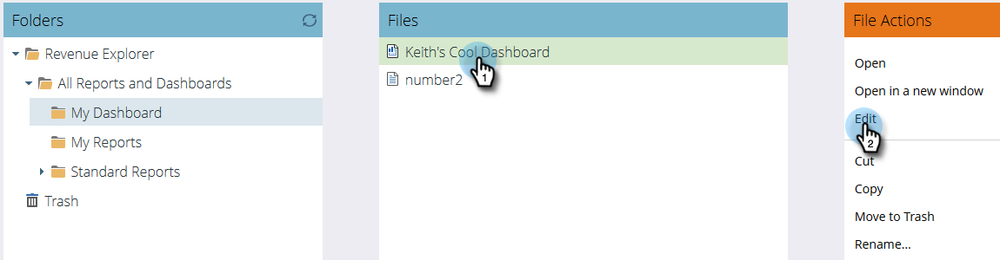

# Uso de tableros en el Explorador de ingresos {#using-dashboards-in-revenue-explorer}

Un tablero es una combinación de informes del Explorador de ingresos para obtener información general rápida sobre posibles clientes, campañas, oportunidades y/o modelos.

## Creación de un nuevo tablero {#creating-a-new-dashboard}

1. Haga clic en **Explorador de ingresos**.

   

1. Haga clic en **Crear nuevo**, luego **Panel**.

   

1. En la parte inferior de la página, las plantillas se seleccionarán de forma predeterminada. Haga clic en el diseño que desee utilizar. Aquí se usa &quot;2 columnas&quot;.

   

   >[!NOTE]
   >
   >Puede personalizar aún más el aspecto del tablero haciendo clic en **Temas** y elegir tu favorito.

1. En la primera sección del tablero, haga clic en el **Insertar** y seleccione **Archivo**.

   

1. Hacer doble clic **Explorador de ingresos**.

   

1. Hacer doble clic **Todos los informes y tableros**.

   

1. Haga doble clic en la carpeta que aloja el informe que desee utilizar.

   

1. Elija el informe y haga clic en **Select**.

   

1. A continuación, se rellenará el informe. Repita los pasos del 4 al 8 para cada sección restante.

   

1. Para cambiar el nombre de una sección, haga clic en ella para seleccionarla, escriba el nombre que desee en Título y haga clic en **Aplicar**. Repita el proceso para cada sección.

   

1. Para guardar, haga clic en el icono Guardar, introduzca un nombre de archivo, haga doble clic en la carpeta del Explorador de ingresos hasta que llegue a la carpeta deseada para el tablero y haga clic en **Guardar**.

   

## Edición de un tablero {#editing-a-dashboard}

1. Haga clic en **Explorador de ingresos**.

   

1. Haga doble clic en el botón **Explorador de ingresos** carpeta. Navegue hasta el lugar donde reside el tablero.

   

1. Seleccione el tablero que desea editar y, a continuación, haga clic en **Editar**.

   

## Eliminación de un tablero {#deleting-a-dashboard}

1. Haga clic en **Explorador de ingresos**.

   

1. Haga doble clic en el botón **Explorador de ingresos** carpeta. Navegue hasta el lugar donde reside el tablero.

   

1. Seleccione el tablero que desea eliminar y haga clic en **Mover a la papelera**.

   
