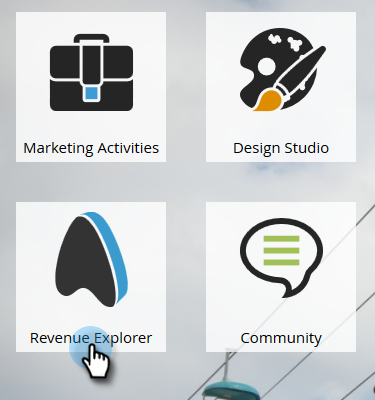

# Uso de paneles en el Explorador de ingresos {#using-dashboards-in-revenue-explorer}

Un tablero es una combinación de informes del Explorador de ingresos para obtener una visión general rápida de los posibles clientes, las campañas, las oportunidades o los modelos.

## Creación de un nuevo tablero {#creating-a-new-dashboard}

1. Haga clic en **Explorador de ingresos**.

   

1. Haga clic en **Crear nuevo** y luego en **Tablero**.

   

1. En la parte inferior de la página, se seleccionan las plantillas de forma predeterminada. Haga clic en el diseño que desee utilizar. Aquí se utiliza &quot;2 Column&quot;.

   

   >[!NOTE]
   >
   >Puede personalizar aún más el aspecto de su tablero si hace clic en **Temas** y elige su favorito.

1. En la primera sección del panel, haga clic en el icono **Insertar** y seleccione **Archivo**.

   

1. Haga doble clic en **Explorador de ingresos**.

   

1. Haga doble clic en **Todos los informes y paneles**.

   

1. Haga doble clic en la carpeta que contiene el informe que desea utilizar.

   

1. Elija su informe y haga clic en **Seleccionar**.

   

1. A continuación, el informe se rellenará. Repita los pasos 4-8 para cada sección restante.

   

1. Para cambiar el nombre de una sección, haga clic en ella para seleccionarla, escriba el nombre deseado en Título y haga clic en **Aplicar**. Repita el proceso para cada sección.

   

1. Para guardar, haz clic en el icono Guardar, escribe un nombre de archivo, haz doble clic en la carpeta del Explorador de ingresos hasta que llegues a la carpeta deseada para tu panel y haz clic en **Guardar**.

   

## Edición de un tablero {#editing-a-dashboard}

1. Haga clic en **Explorador de ingresos**.

   

1. Haga doble clic en la carpeta **Explorador de ingresos**. Desplácese hasta donde se encuentre el tablero.

   

1. Seleccione el tablero que desee editar y luego haga clic en **Editar**.

   

## Eliminación de un panel {#deleting-a-dashboard}

1. Haga clic en **Explorador de ingresos**.

   

1. Haga doble clic en la carpeta **Explorador de ingresos**. Desplácese hasta donde se encuentre el tablero.

   

1. Seleccione el tablero que desee eliminar y haga clic en **Mover a la papelera**.

   
