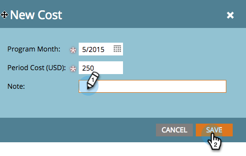
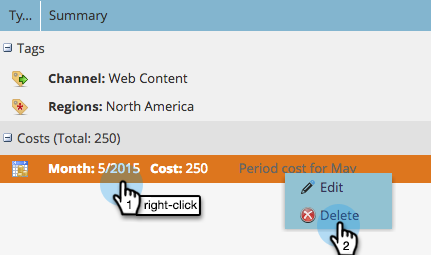
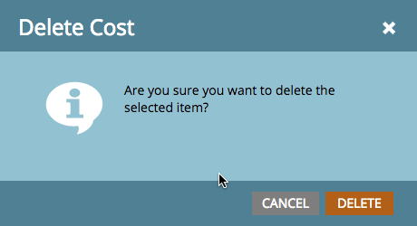

# Definir costos de período {#define-period-costs}

>[!NOTE]
>
>**Definición**
>
>Un costo de período es la cantidad que gasta en un programa. Puede durar uno o más meses y se utiliza para el retorno de la inversión en sistemas de informes.

Rastree y asocie los costos de adquisición de posibles clientes y de alimentación para un Programa o Evento definiendo cuándo y dónde desea tomar los costos de los posibles clientes.

>[!NOTE]
>
>Al principio de un Programa, introduzca los costes previstos. Una vez finalizado el período en el Programa, puede editar el costo del período e introducir el costo real. Esto le proporcionará resultados de sistema de informes precisos.

## Definir un costo de período {#define-a-period-cost}

1. Acceda a la ficha **Configuración** de su Programa o Evento.

   

1. Arrastre y suelte **Costo de período** en el lienzo y se abre el cuadro de diálogo **Costo nuevo**.

   

1. Introduzca el **Mes de Programa** que desea asociar con el costo definido.

   

1. Escriba un **Costo de período** como número entero sin decimales ni comas (límite máximo: 99999999)

   

   >[!NOTE]
   >
   >La moneda (por ejemplo, USD, EUR, etc.) es una configuración global administrada por un administrador de marketing

1. Introduzca una **Nota** descriptiva (opcional) y haga clic en **Guardar**.

   

## Editar un costo de período {#edit-a-period-cost}

1. Haga clic con el botón derecho en el costo del período y seleccione **Editar** en el menú emergente para abrir el cuadro de diálogo **Editar costo**.

   

1. Edite el costo del período según sea necesario

   

## Eliminar un costo de período {#delete-a-period-cost}

1. Haga clic con el botón secundario en el costo de período que desee eliminar y seleccione **Eliminar** en el menú emergente para mostrar el mensaje **Eliminar costo**.

   

1. Haga clic en **Eliminar** para eliminar permanentemente el costo del período o **Cancelar** para volver atrás.

   
